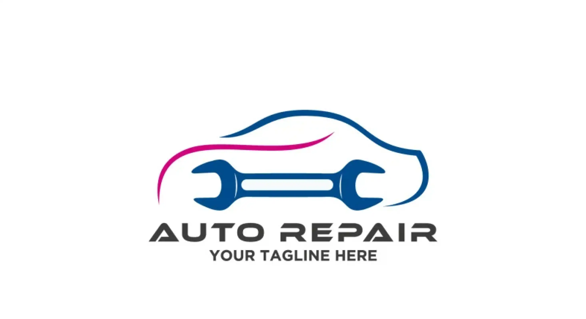
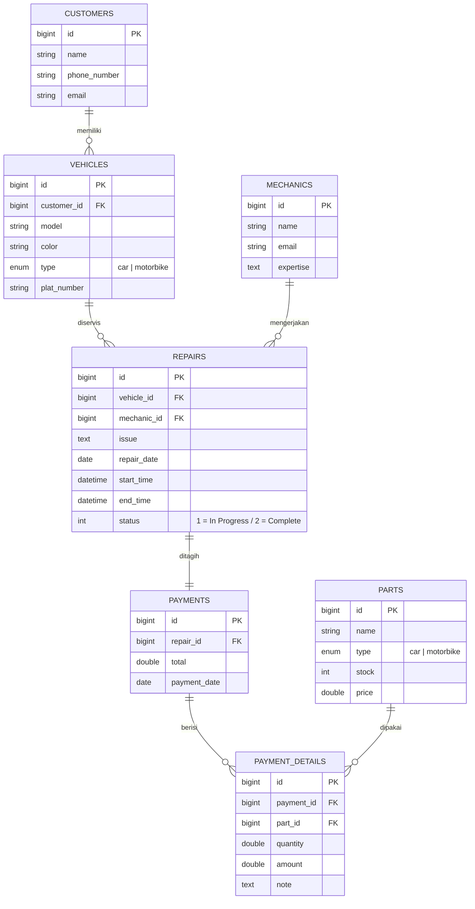
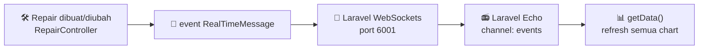

<div align="center">



# 🔧 Monitoring System — Vehicle Repair Shop

**Dashboard monitoring bengkel kendaraan secara real-time** — pantau antrean servis, efisiensi mekanik, stok sparepart, dan pendapatan bengkel dalam satu layar.

[](https://laravel.com)
[](https://php.net)
[](https://mysql.com)
[](https://vitejs.dev)
[](https://beyondco.de/docs/laravel-websockets)
[](#-lisensi)

</div>

---

## 📑 Daftar Isi

| | | |
|---|---|---|
| 🎯 [Tentang Project](#-tentang-project) | ✨ [Fitur Utama](#-fitur-utama) | 🧰 [Tech Stack](#-tech-stack) |
| 🗂️ [Struktur Project](#️-struktur-project) | 🧬 [Skema Database](#-skema-database) | ⚙️ [Prasyarat](#️-prasyarat) |
| 🚀 [Instalasi](#-instalasi) | ▶️ [Menjalankan Project](#️-menjalankan-project) | 📡 [Konfigurasi Real-Time](#-konfigurasi-real-time) |
| 🗺️ [Daftar Route](#️-daftar-route) | 🧪 [Testing](#-testing) | 🩺 [Troubleshooting](#-troubleshooting) |
| 💡 [Saran Pengembangan](#-saran-pengembangan) | 📚 [Dokumentasi](#-dokumentasi) | 📄 [Lisensi](#-lisensi) |

---

## 📚 Dokumentasi

Dokumentasi lengkap sistem tersedia di folder **[`docs/`](docs/)**:

| Dokumen | Isi |
|---|---|
| 📘 **[SRS.md](docs/SRS.md)** | *Software Requirement Specification* format IEEE 830 — kebutuhan fungsional bernomor, kebutuhan non-fungsional, kamus data, roadmap, dan catatan temuan |
| 📋 **[FEATURES.md](docs/FEATURES.md)** | Daftar seluruh fitur berikut statusnya (✅ / ⚠️ / ❌), tertaut ke kode dan nomor kebutuhan SRS |
| 🗺️ **[FLOWMAP.md](docs/FLOWMAP.md)** | Tujuh diagram alur proses bisnis dan alur sistem |

> 💡 Ingin tahu fitur mana yang sudah jalan dan mana yang belum? Mulai dari **[ringkasan cakupan fitur](docs/FEATURES.md#-ringkasan-cakupan)**.

---

## 🎯 Tentang Project

Aplikasi web berbasis **Laravel 10** untuk memonitor seluruh operasional bengkel kendaraan (mobil & motor). Alur bisnisnya sederhana: **pelanggan → kendaraan → servis (repair) → pembayaran**, dan setiap perubahan status servis langsung ter-*push* ke dashboard lewat **WebSocket** tanpa perlu refresh halaman.

Dashboard menyajikan enam sudut pandang data sekaligus:

> 🚗 Status servis per divisi &nbsp;•&nbsp; 📊 Tren servis selesai &nbsp;•&nbsp; 💰 Pendapatan harian
> 🧑‍🔧 Efisiensi tiap mekanik &nbsp;•&nbsp; ⏱️ Rata-rata waktu pengerjaan &nbsp;•&nbsp; 🥧 Komposisi antrean

---

## ✨ Fitur Utama

### 📊 Dashboard Analitik Real-Time
- **Kartu status interaktif** — jumlah mobil/motor `In Progress` & `Complete`; klik kartu untuk langsung melompat ke daftar servis yang terfilter.
- **Pie chart** komposisi antrean servis per jenis kendaraan.
- **Bar chart** total servis selesai dalam 7 hari terakhir (mobil vs motor).
- **Area chart** total pendapatan 30 hari terakhir + pendapatan per divisi.
- **Gauge chart** efisiensi mekanik (servis selesai ÷ total jam kerja).
- **Bar chart** rata-rata waktu pengerjaan mobil vs motor.
- ⚡ **Auto-update via WebSocket** — begitu data servis dibuat/diubah, event `RealTimeMessage` disiarkan dan **kartu status beserta pie chart** langsung memperbarui diri tanpa refresh. *(Grafik tren, pendapatan, efisiensi, dan rata-rata waktu baru ikut berubah setelah halaman disegarkan — lihat [catatan B-6](docs/SRS.md#lampiran-b--catatan-implementasi--temuan).)*
- 🌗 **Dark & light mode** — warna chart ikut menyesuaikan tema aktif.

### 🗃️ Modul Manajemen Data (CRUD)
| Modul | Ikon | Cakupan |
|---|:---:|---|
| **Customer** | 👥 | Data pelanggan + daftar kendaraan miliknya |
| **Vehicle** | 🚙 | Model, warna, jenis (mobil/motor), plat nomor, relasi ke pemilik |
| **Mechanic** | 🧑‍🔧 | Data mekanik beserta bidang keahlian |
| **Part** | 🔩 | Sparepart: jenis, stok, harga satuan |
| **Repair** | 🛠️ | Keluhan, tanggal servis, jam mulai/selesai, mekanik penanggung jawab, status |
| **Payment** | 🧾 | Nota pembayaran + rincian sparepart yang terpakai (stok otomatis berkurang) |

### 🧩 Fitur Pendukung
- 📥 **Seeder berbasis Excel** — data awal diimpor dari file `.xlsx` di `public/data` memakai `maatwebsite/excel`.
- 🔔 **Notifikasi SweetAlert** untuk setiap aksi sukses/gagal.
- 🔎 **DataTables** (search, sort, pagination) di semua tabel data.
- 🛡️ **Proteksi hapus data** — penghapusan yang melanggar relasi dibatalkan lewat transaksi DB dan dikembalikan sebagai pesan error yang ramah.

---

## 🧰 Tech Stack

<div align="center">

| Lapisan | Teknologi |
|---|---|
| 🖥️ **Backend** | Laravel 10 · PHP 8.1+ |
| 🎨 **Frontend** | Blade · Bootstrap 5 (tema Metronic) · jQuery · ApexCharts · DataTables |
| 🗄️ **Database** | MySQL / MariaDB |
| 📡 **Real-Time** | Laravel Broadcasting · `beyondcode/laravel-websockets` · Laravel Echo · Pusher JS |
| 📦 **Build Tool** | Vite 4 |
| 📗 **Excel** | `maatwebsite/excel` |
| 🍬 **Alert** | `realrashid/sweet-alert` |
| 🔐 **Auth Scaffold** | Laravel Sanctum *(tersedia, belum diaktifkan — lihat [Saran](#-saran-pengembangan))* |

</div>

---

## 🗂️ Struktur Project

```
monitoring-system-vehicle-repair-shop/
├── app/
│   ├── Events/RealTimeMessage.php      # 📡 Event broadcast ke channel "events"
│   ├── Http/Controllers/
│   │   ├── DashboardController.php     # 📊 Semua endpoint data chart
│   │   ├── CustomerController.php      # 👥 CRUD pelanggan
│   │   ├── VehicleController.php       # 🚙 CRUD kendaraan
│   │   ├── MechanicsController.php     # 🧑‍🔧 CRUD mekanik
│   │   ├── PartController.php          # 🔩 CRUD sparepart
│   │   ├── RepairController.php        # 🛠️ CRUD servis (+ trigger event)
│   │   └── PaymentController.php       # 🧾 Pembayaran & rincian
│   ├── Imports/                        # 📥 Importer Excel untuk seeder
│   └── Models/                         # 🧬 Customer, Vehicle, Mechanic, Part, Repair, Payment, PaymentDetail
├── config/websockets.php               # ⚙️ Konfigurasi server WebSocket
├── database/
│   ├── migrations/                     # 🧱 Skema tabel
│   └── seeders/                        # 🌱 Seeder yang membaca file Excel
├── public/
│   ├── assets/                         # 🎨 Tema Metronic (css, js, plugins, images)
│   └── data/*.xlsx                     # 📗 Dataset awal
├── resources/
│   ├── js/bootstrap.js                 # 🔌 Inisialisasi Laravel Echo
│   └── views/                          # 🖼️ Blade: home (dashboard), customers, mechanics, parts, repairs
└── routes/
    ├── web.php                         # 🗺️ Route halaman & endpoint chart
    └── channels.php                    # 📻 Otorisasi channel broadcast
```

---

## 🧬 Skema Database



---

## ⚙️ Prasyarat

Pastikan perangkat sudah terpasang:

| Kebutuhan | Versi Minimum | Cek Versi |
|---|---|---|
| 🐘 **PHP** | `8.1` | `php -v` |
| 🎼 **Composer** | `2.x` | `composer -V` |
| 🟢 **Node.js** | `16+` | `node -v` |
| 📦 **NPM** | `8+` | `npm -v` |
| 🗄️ **MySQL / MariaDB** | `5.7+` / `10.3+` | `mysql --version` |

> 💡 Ekstensi PHP wajib: `pdo_mysql`, `mbstring`, `openssl`, `tokenizer`, `xml`, `ctype`, `json`, `bcmath`, `fileinfo`, **`zip`** & **`gd`** (dibutuhkan `maatwebsite/excel` untuk membaca file `.xlsx`).
> Paket XAMPP/Laragon standar sudah mencakup semuanya.

---

## 🚀 Instalasi

### 1️⃣ Clone repository

```bash
git clone https://github.com/Almasyriqi/monitoring-system-vehicle-repair-shop.git
cd monitoring-system-vehicle-repair-shop
```

### 2️⃣ Install dependency PHP

```bash
composer install
```

### 3️⃣ Install dependency JavaScript

```bash
npm install
```

### 4️⃣ Siapkan file environment

```bash
cp .env.example .env      # Windows (CMD): copy .env.example .env
php artisan key:generate
```

### 5️⃣ Buat database

```sql
CREATE DATABASE monitoring_system_vehicle_repair_shop;
```

Lalu sesuaikan kredensial di `.env`:

```env
DB_CONNECTION=mysql
DB_HOST=127.0.0.1
DB_PORT=3306
DB_DATABASE=monitoring_system_vehicle_repair_shop
DB_USERNAME=root
DB_PASSWORD=
```

### 6️⃣ Aktifkan broadcasting WebSocket

Ubah bagian berikut di `.env` (detail lengkap di [Konfigurasi Real-Time](#-konfigurasi-real-time)):

```env
BROADCAST_DRIVER=pusher

PUSHER_APP_ID=repairshop
PUSHER_APP_KEY=repairshopkey
PUSHER_APP_SECRET=repairshopsecret
PUSHER_HOST=127.0.0.1
PUSHER_PORT=6001
PUSHER_SCHEME=http
PUSHER_APP_CLUSTER=mt1
```

### 7️⃣ Migrasi & seeding data

```bash
php artisan migrate --seed
```

> 🌱 Seeder mengimpor dataset contoh (pelanggan, kendaraan, mekanik, sparepart, servis, pembayaran) dari file Excel di `public/data/`.
> Ingin database kosong? Cukup jalankan `php artisan migrate` saja.

### 8️⃣ Build aset frontend

```bash
npm run build     # untuk produksi
# atau lewati langkah ini dan gunakan `npm run dev` saat development
```

---

## ▶️ Menjalankan Project

Aplikasi ini butuh **tiga proses** yang berjalan bersamaan. Buka tiga terminal terpisah di folder project:

<table>
<tr><th>#</th><th>Terminal</th><th>Perintah</th><th>Fungsi</th></tr>
<tr>
<td>1️⃣</td><td>🌐 <b>Web Server</b></td>
<td><code>php artisan serve</code></td>
<td>Menjalankan aplikasi di <code>http://127.0.0.1:8000</code></td>
</tr>
<tr>
<td>2️⃣</td><td>📡 <b>WebSocket Server</b></td>
<td><code>php artisan websockets:serve</code></td>
<td>Server realtime di port <code>6001</code></td>
</tr>
<tr>
<td>3️⃣</td><td>⚡ <b>Vite Dev Server</b></td>
<td><code>npm run dev</code></td>
<td>Hot reload aset CSS/JS (skip jika sudah <code>npm run build</code>)</td>
</tr>
</table>

Lalu buka 👉 **<http://127.0.0.1:8000>**

### 🖥️ Ringkasan satu blok

```bash
# Terminal 1
php artisan serve

# Terminal 2
php artisan websockets:serve

# Terminal 3
npm run dev
```

### 🔍 Memantau koneksi WebSocket

Paket `laravel-websockets` menyediakan dashboard debug bawaan:

👉 **<http://127.0.0.1:8000/laravel-websockets>**

Klik **Connect**, lalu ubah status sebuah data servis di aplikasi — event `RealTimeMessage` akan muncul di log dashboard tersebut.

### ✅ Uji fitur real-time

1. Buka dashboard di **dua tab browser** berbeda.
2. Di tab pertama, buat data servis baru (`Repair → Add`) atau ubah statusnya menjadi *Complete*.
3. 🎉 Chart dan kartu status di **tab kedua ikut berubah otomatis** tanpa refresh.

---

## 📡 Konfigurasi Real-Time

Alur broadcasting pada aplikasi ini:



**Komponen yang terlibat**

| Berkas | Peran |
|---|---|
| `app/Events/RealTimeMessage.php` | Event `ShouldBroadcast` ke channel publik `events` |
| `routes/channels.php` | Otorisasi channel `events` |
| `config/websockets.php` | Kredensial & port server WebSocket (default `6001`) |
| `config/broadcasting.php` | Koneksi Pusher yang diarahkan ke server lokal |
| `resources/js/bootstrap.js` | Inisialisasi Laravel Echo di sisi browser |
| `resources/views/home.blade.php` | Listener `Echo.channel('events')` yang memicu refresh chart |

> ⚠️ **Penting untuk development lokal (HTTP):**
> `resources/js/bootstrap.js` saat ini memakai `forceTLS: true`. Bila server WebSocket dijalankan tanpa sertifikat SSL, ubah menjadi `forceTLS: false` lalu jalankan ulang `npm run dev`/`npm run build`, agar koneksi `ws://` tidak diblokir browser.

---

## 🗺️ Daftar Route

### 📄 Halaman & Resource

| Method | URI | Nama Route | Keterangan |
|---|---|---|---|
| `GET` | `/` | `home` | 📊 Dashboard monitoring |
| `resource` | `/customer` | `customer.*` | 👥 CRUD pelanggan |
| `resource` | `/vehicle` | `vehicle.*` | 🚙 CRUD kendaraan |
| `resource` | `/mechanic` | `mechanic.*` | 🧑‍🔧 CRUD mekanik |
| `resource` | `/part` | `part.*` | 🔩 CRUD sparepart |
| `resource` | `/repair` | `repair.*` | 🛠️ CRUD servis |
| `resource` | `/payment` | `payment.*` | 🧾 CRUD pembayaran |

### 📈 Endpoint Data Chart (JSON)

| Method | URI | Nama Route | Mengembalikan |
|---|---|---|---|
| `GET` | `/getDataStatus` | `status.vehicle` | Jumlah servis per status & jenis kendaraan |
| `GET` | `/getCompleteRepairs` | `complete.repairs` | Servis selesai 7 hari terakhir |
| `GET` | `/getAverageTime` | `average.time` | Rata-rata jam pengerjaan mobil & motor |
| `GET` | `/getRevenueData` | `revenue.data` | Pendapatan 30 hari terakhir (total & per divisi) |
| `GET` | `/getMechanicEfficient` | `efficiency.mechanic` | Skor efisiensi seorang mekanik |
| `GET` | `/vehicles` | `vehicles` | Daftar kendaraan milik pelanggan tertentu |

> 💡 Cek seluruh route kapan saja dengan `php artisan route:list`.

---

## 🧪 Testing

```bash
php artisan test
```

Atau langsung lewat PHPUnit:

```bash
./vendor/bin/phpunit
```

Cek gaya penulisan kode dengan **Laravel Pint**:

```bash
./vendor/bin/pint --test    # hanya memeriksa
./vendor/bin/pint           # sekaligus memperbaiki
```

---

## 🩺 Troubleshooting

<details>
<summary><b>❌ Chart tidak ter-update otomatis</b></summary>

- Pastikan `php artisan websockets:serve` sedang berjalan.
- Pastikan `BROADCAST_DRIVER=pusher` (bukan `log`) di `.env`.
- Setel `forceTLS: false` di `resources/js/bootstrap.js` untuk development HTTP, lalu build ulang aset.
- Bersihkan cache konfigurasi: `php artisan config:clear`.
- Cek tab **Console** & **Network → WS** di browser untuk melihat error koneksi.
</details>

<details>
<summary><b>❌ <code>Address already in use</code> pada port 6001</b></summary>

Port sedang dipakai proses lain. Ubah port di `.env` (`LARAVEL_WEBSOCKETS_PORT` dan `PUSHER_PORT`), atau hentikan prosesnya:

```bash
# Linux / macOS
lsof -i :6001 && kill -9 <PID>

# Windows
netstat -ano | findstr :6001
taskkill /PID <PID> /F
```
</details>

<details>
<summary><b>❌ Seeder gagal membaca file Excel</b></summary>

Aktifkan ekstensi `zip` dan `gd` di `php.ini`, lalu restart web server. Pastikan pula file `.xlsx` masih ada di `public/data/`.
</details>

<details>
<summary><b>❌ Halaman tampil tanpa styling</b></summary>

Aset Vite belum dibangun. Jalankan `npm run dev` (development) atau `npm run build` (produksi). Pastikan `APP_URL` di `.env` sesuai dengan alamat yang dibuka di browser.
</details>

<details>
<summary><b>❌ <code>SQLSTATE[HY000] [1045] Access denied</code></b></summary>

Kredensial database di `.env` belum sesuai. Perbaiki `DB_USERNAME`/`DB_PASSWORD`, lalu jalankan `php artisan config:clear`.
</details>

<details>
<summary><b>❌ <code>419 Page Expired</code> saat submit form</b></summary>

Session/CSRF token kedaluwarsa. Refresh halaman, lalu jalankan `php artisan cache:clear && php artisan config:clear`.
</details>

---

## 💡 Saran Pengembangan

Hasil telaah kode saat ini — diurutkan dari yang paling berdampak:

### 🔴 Prioritas Tinggi

| # | Temuan | Rekomendasi |
|---|---|---|
| 1 | 🔓 **Belum ada autentikasi.** Seluruh route di `web.php` dapat diakses publik, padahal tabel `users` dan Sanctum sudah tersedia. | Pasang **Laravel Breeze**, bungkus route dengan middleware `auth`, dan tambahkan *role* (admin / kasir / mekanik). |
| 2 | 🧾 **Input belum divalidasi.** Controller menyalin `$request->...` langsung ke model tanpa `validate()`. | Gunakan **Form Request** (`php artisan make:request StoreRepairRequest`) untuk aturan `required`, `email`, `numeric`, `exists`, dsb. |
| 3 | ⚠️ **Potensi *division by zero*** di `DashboardController@getMechanicEfficient` ketika `total_time_spent` bernilai `0`. | Kembalikan `0` lebih awal bila total jam kerja `0`, seperti pola yang sudah dipakai di `getAverageTime()`. |
| 4 | 🐌 **Query N+1 di dashboard.** `getCompleteRepairs()` dan `getRevenueData()` menjalankan query di dalam perulangan tanggal, dan `getAverageTime()` memuat seluruh baris `repairs` ke memori. | Ganti dengan agregasi tunggal: `selectRaw('repair_date, COUNT(*)')->groupBy('repair_date')`. Tambahkan indeks pada `repairs.repair_date`, `repairs.status`, dan `payments.payment_date`. |
| 5 | 🔐 **Verifikasi TLS dimatikan** di `config/broadcasting.php` (`CURLOPT_SSL_VERIFYPEER => 0`, `'verify' => false`) dan host/port di-*hardcode*. | Pindahkan `host`, `port`, dan `scheme` ke variabel `.env`; aktifkan kembali verifikasi TLS untuk lingkungan produksi. |

### 🟡 Prioritas Menengah

| # | Temuan | Rekomendasi |
|---|---|---|
| 6 | 📦 **`beyondcode/laravel-websockets` sudah tidak dikembangkan lagi.** | Migrasikan ke **[Laravel Reverb](https://reverb.laravel.com)** (WebSocket resmi Laravel) saat naik ke Laravel 11. |
| 7 | 🐞 **Event debug tertinggal** — `CustomerController@index` masih menyiarkan `"Hello World! I am an event 😄"` di setiap kunjungan halaman. | Hapus baris tersebut. |
| 8 | 🧪 **Belum ada test bermakna** — hanya `ExampleTest` bawaan Laravel. | Tambahkan *feature test* untuk alur inti: buat servis → selesaikan → buat pembayaran → stok sparepart berkurang. |
| 9 | ⏳ **Broadcast berjalan sinkron** (`QUEUE_CONNECTION=sync`), sehingga request menunggu proses siaran. | Gunakan queue (`database` atau `redis`) dan jalankan `php artisan queue:work`. |
| 10 | 🧯 **Pencarian model tanpa penanganan data kosong.** Controller memakai `Model::find($id)` lalu langsung mengakses propertinya — ID yang tidak ada memicu *error* `null`. | Ganti dengan `findOrFail($id)` agar Laravel mengembalikan halaman **404** yang rapi. |
| 11 | 🔑 **`'id'` masuk `$fillable`** pada model `Repair` — berisiko *mass assignment*. | Hapus `'id'` dari `$fillable`; importer Excel dapat menetapkan ID secara eksplisit. |

### 🟢 Penyempurnaan

| # | Ide | Manfaat |
|---|---|---|
| 12 | 📄 **Ekspor laporan PDF/Excel** (`maatwebsite/excel` sudah terpasang) | Rekap servis & pendapatan bulanan siap cetak |
| 13 | 🔔 **Notifikasi WhatsApp/email** ke pelanggan saat servis selesai | Meningkatkan kualitas layanan |
| 14 | 📅 **Penjadwalan & antrean servis** memakai FullCalendar (plugin sudah tersedia di tema) | Distribusi beban kerja mekanik lebih merata |
| 15 | 🚨 **Peringatan stok menipis** pada sparepart | Mencegah kehabisan stok mendadak |
| 16 | 🧭 **Filter rentang tanggal** pada dashboard | Analisis periode tertentu jadi fleksibel |
| 17 | 🤖 **CI/CD GitHub Actions** (`pint --test` + `php artisan test`) | Kualitas kode terjaga otomatis di setiap push |
| 18 | 🐳 **Laravel Sail / Docker** (`laravel/sail` sudah ada di `require-dev`) | Setup satu perintah, konsisten di semua mesin |
| 19 | 🖼️ **Screenshot dashboard** di README | Pengunjung repo langsung paham tampilan aplikasi |
| 20 | 🌐 **Konsistensi bahasa antarmuka** (kini campur Inggris–Indonesia) | Pengalaman pengguna lebih rapi |

---

## 📄 Lisensi

Project ini dilisensikan di bawah **[MIT License](https://opensource.org/licenses/MIT)** — bebas digunakan, dimodifikasi, dan didistribusikan.

---

<div align="center">


**Dibangun dengan ❤️ menggunakan Laravel**

⭐ Beri bintang jika project ini bermanfaat!

</div>
