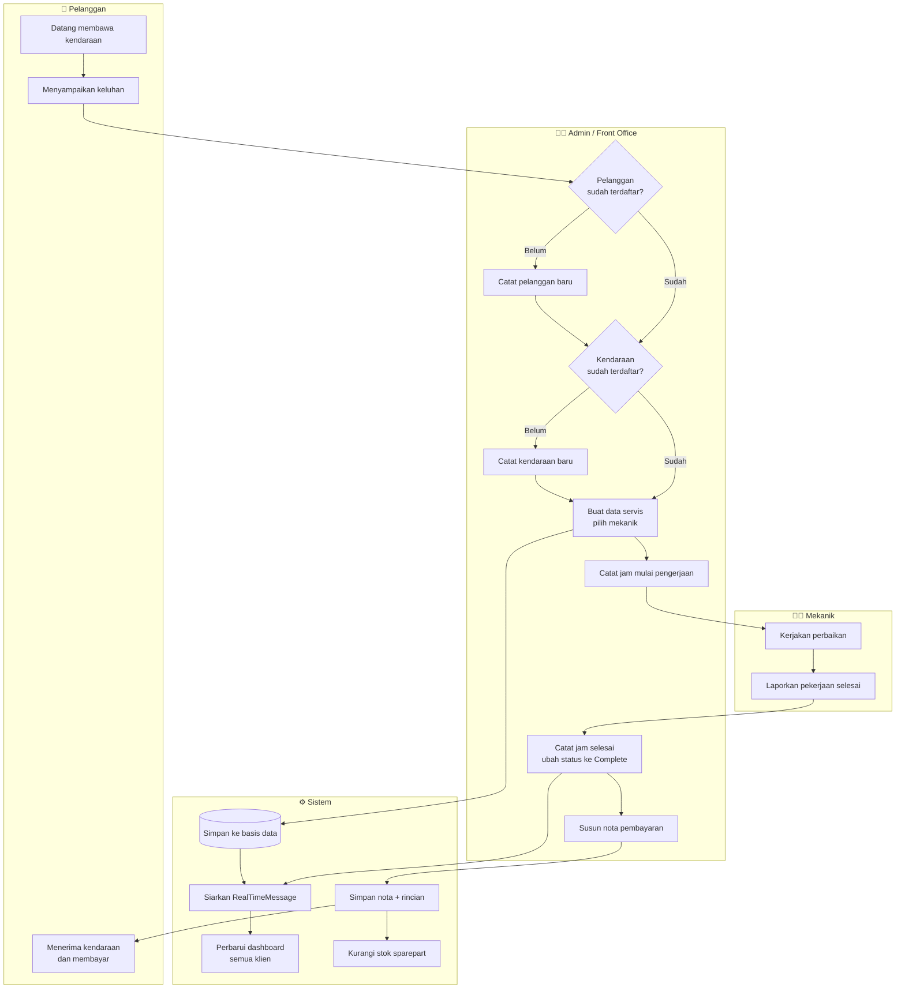
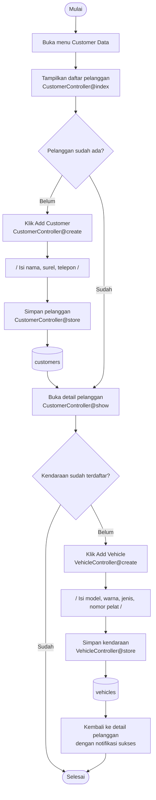
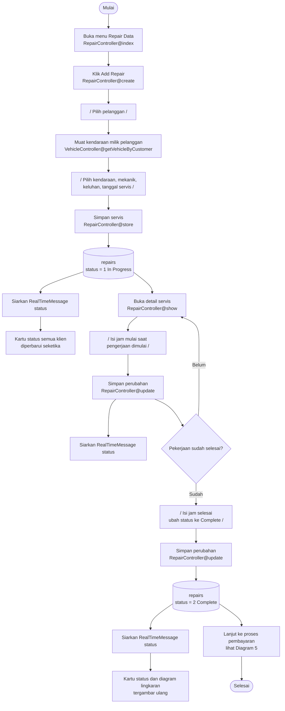
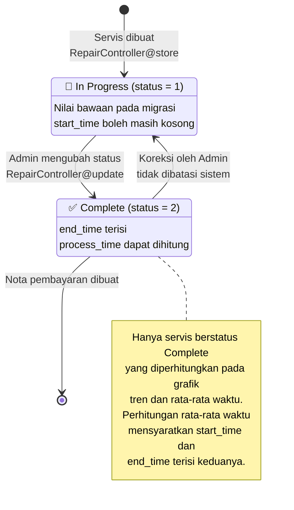
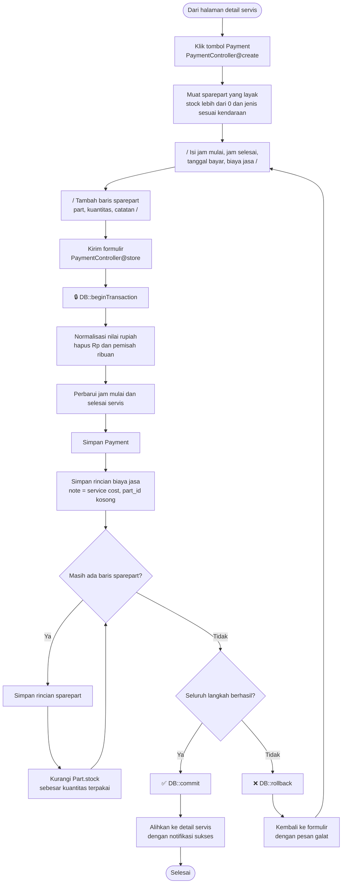
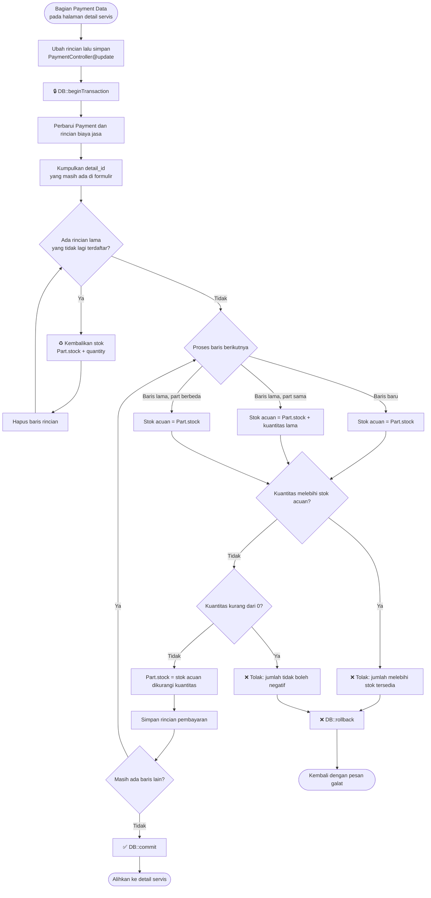
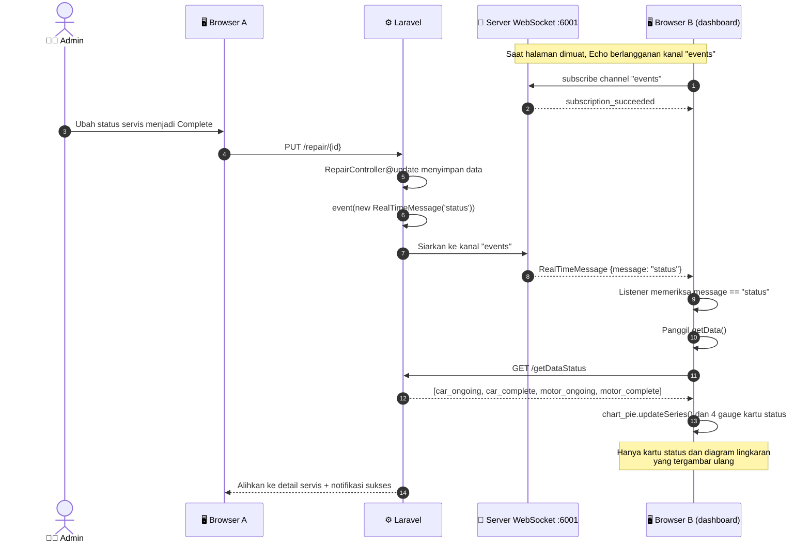
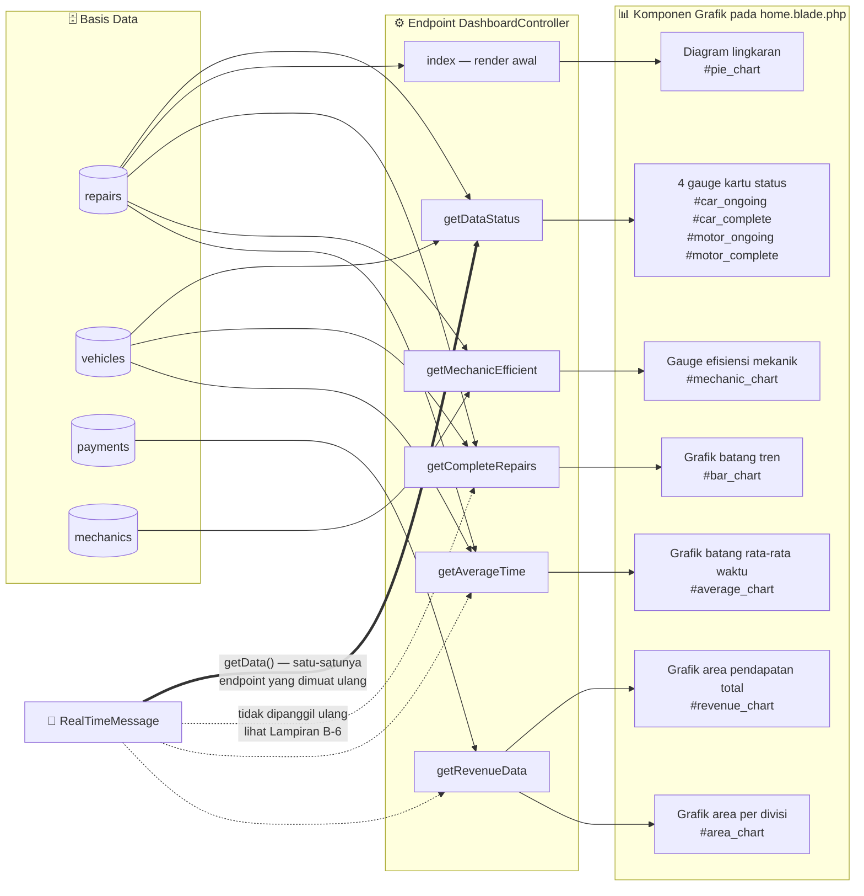

# 🗺️ Flowmap Sistem

### Monitoring System — Vehicle Repair Shop

| | |
|---|---|
| **Versi Dokumen** | 1.0 |
| **Tanggal** | 7 September 2026 |
| **Basis Kode** | Branch `claude/readme-update-design-y5ctm0` |
| **Notasi** | Mermaid — dirender otomatis oleh GitHub |
| **Dokumen Terkait** | [SRS](SRS.md) · [Daftar Fitur](FEATURES.md) |

> 📌 Seluruh diagram menggambarkan **alur yang benar-benar berjalan di kode**, bukan rancangan ideal. Setiap simpul proses menyebut controller atau berkas yang menanganinya.

---

## 📑 Daftar Diagram

| # | Diagram | Cakupan |
|---:|---|---|
| 1 | [Flowmap Sistem Keseluruhan](#1--flowmap-sistem-keseluruhan) | Alur lengkap dari kendaraan masuk hingga nota selesai |
| 2 | [Pendaftaran Pelanggan & Kendaraan](#2--pendaftaran-pelanggan--kendaraan) | Pencatatan data induk pelanggan |
| 3 | [Siklus Hidup Servis](#3--siklus-hidup-servis) | Pencatatan hingga penyelesaian pekerjaan servis |
| 4 | [Status Servis](#4--status-servis) | Perubahan keadaan `status` pada tabel `repairs` |
| 5 | [Proses Pembayaran & Stok](#5--proses-pembayaran--stok) | Penyusunan nota dan penyesuaian stok sparepart |
| 6 | [Notifikasi Real-Time](#6--notifikasi-real-time) | Perjalanan siaran dari controller ke grafik |
| 7 | [Aliran Data Dashboard](#7--aliran-data-dashboard) | Enam endpoint JSON menuju komponen grafiknya |

---

## 1 · 🏁 Flowmap Sistem Keseluruhan

Diagram lajur (*swimlane*) yang memetakan seluruh proses bisnis bengkel. Perhatikan bahwa **Pelanggan dan Mekanik tidak berinteraksi langsung dengan sistem** — seluruh pencatatan dilakukan oleh Admin, sesuai batasan **BT-01** pada [SRS](SRS.md#24-batasan).

**Berkas terkait:** `CustomerController` · `VehicleController` · `RepairController` · `PaymentController`

---

## 2 · 👥 Pendaftaran Pelanggan & Kendaraan

Kendaraan **tidak memiliki menu tersendiri**. Formulir penambahan kendaraan hanya dapat dibuka dari halaman detail pelanggan, sehingga `customer_id` selalu terisi.

**Berkas terkait:** `app/Http/Controllers/CustomerController.php` · `app/Http/Controllers/VehicleController.php` · `resources/views/customers/`

---

## 3 · 🛠️ Siklus Hidup Servis

Inilah alur yang memicu pembaruan dashboard. Perhatikan bahwa **`event(new RealTimeMessage('status'))` dipanggil dua kali**: saat servis dibuat dan saat servis diperbarui.

**Berkas terkait:** `app/Http/Controllers/RepairController.php` · `resources/views/repairs/`

---

## 4 · 🔄 Status Servis

Kolom `repairs.status` hanya mengenal dua nilai. Sistem **tidak mengunci** perubahan status, sehingga servis yang telanjur ditandai selesai masih dapat dikembalikan ke *In Progress* melalui formulir yang sama.

**Berkas terkait:** `database/migrations/2023_12_15_160448_create_repairs_table.php` · `app/Models/Repair.php`

---

## 5 · 🧾 Proses Pembayaran & Stok

Alur paling rumit dalam sistem. Seluruh langkah berjalan **di dalam satu transaksi basis data** — kegagalan pada langkah mana pun mengembalikan seluruh perubahan, termasuk stok sparepart.

### 5.1 Pembuatan Nota Baru

### 5.2 Perubahan Nota — Termasuk Pengembalian Stok

Bagian yang paling mudah keliru dipahami: ketika sebuah baris sparepart **dihapus** dari nota, stoknya **dikembalikan** terlebih dahulu sebelum baris rinciannya dihapus.

**Berkas terkait:** `app/Http/Controllers/PaymentController.php` · `resources/views/repairs/payment.blade.php` · `resources/views/repairs/show.blade.php`

---

## 6 · ⚡ Notifikasi Real-Time

Perjalanan satu siaran dari controller hingga grafik tergambar ulang. Diagram ini menjelaskan mengapa **tiga proses** harus berjalan bersamaan seperti disebut pada [panduan menjalankan](../README.md#️-menjalankan-project).

**Berkas terkait:** `app/Events/RealTimeMessage.php` · `routes/channels.php` · `resources/js/bootstrap.js` · `resources/views/home.blade.php`

> ⚠️ Bila server WebSocket tidak dijalankan, seluruh alur di atas terputus pada langkah siaran. Dashboard tetap tampil normal, tetapi hanya memperbarui diri saat halaman disegarkan secara manual.

> ⚠️ **Cakupan pembaruan terbatas.** `getData()` hanya meminta ulang `GET /getDataStatus`. Grafik tren servis, pendapatan, efisiensi mekanik, dan rata-rata waktu **tidak ikut diperbarui** meski ikut terpengaruh oleh peristiwa yang sama — lihat [Lampiran B-6 pada SRS](SRS.md#lampiran-b--catatan-implementasi--temuan).

---

## 7 · 📊 Aliran Data Dashboard

Pemetaan enam endpoint JSON menuju komponen grafik yang dilayaninya. Sebagian data dirender langsung di server saat halaman dimuat, sisanya diambil lewat AJAX.

**Berkas terkait:** `app/Http/Controllers/DashboardController.php` · `routes/web.php` · `resources/views/home.blade.php`

> ⚠️ Grafik `#area_chart` (pendapatan per divisi) saat ini menampilkan angka yang sama dengan `#revenue_chart` karena penjumlahannya belum tersaring jenis kendaraan — lihat [Lampiran B-1 pada SRS](SRS.md#lampiran-b--catatan-implementasi--temuan).

---

**— Akhir Dokumen —**

[⬆️ Kembali ke atas](#️-flowmap-sistem) · [📘 SRS](SRS.md) · [📋 Daftar Fitur](FEATURES.md)

