

# 📖 Manual Penggunaan

### Monitoring System — Vehicle Repair Shop

Panduan bergambar untuk petugas bengkel

| | |
|---|---|
| **Versi Dokumen** | 1.0 |
| **Tanggal** | 7 September 2026 |
| **Untuk** | Admin / petugas front office bengkel |
| **Dokumen Terkait** | [SRS](SRS.md) · [Daftar Fitur](FEATURES.md) · [Flowmap](FLOWMAP.md) · [Cara Instalasi](../README.md#-instalasi) |

> 📷 **Tentang gambar di manual ini.** Seluruh tangkapan layar diambil otomatis dari aplikasi yang benar-benar berjalan, memakai **data contoh** dari berkas latihan — bukan data bengkel sungguhan. Nama pelanggan, angka pendapatan, dan jumlah servis yang Anda lihat hanyalah contoh.

---

## 📑 Daftar Isi

| Bab | Isi |
|---|---|
| [1. Pendahuluan](#1-pendahuluan) | Untuk siapa manual ini dan apa yang perlu disiapkan |
| [2. Mengenal Antarmuka](#2-mengenal-antarmuka) | Bagian-bagian layar dan cara berpindah menu |
| [3. Dashboard](#3-dashboard) | Membaca keenam indikator bengkel |
| [4. Data Pelanggan](#4-data-pelanggan) | Mendaftarkan dan mengelola pelanggan |
| [5. Data Kendaraan](#5-data-kendaraan) | Mencatat kendaraan milik pelanggan |
| [6. Data Mekanik](#6-data-mekanik) | Mengelola daftar mekanik |
| [7. Data Sparepart](#7-data-sparepart) | Mengelola stok dan harga sparepart |
| [8. Data Servis](#8-data-servis) | Mencatat dan memantau pekerjaan servis |
| [9. Pembayaran](#9-pembayaran) | Menyusun nota dan pengaruhnya ke stok |
| [10. Alur Kerja Harian](#10-alur-kerja-harian) | Satu skenario utuh dari awal sampai selesai |
| [11. Pesan Galat](#11-pesan-galat-yang-mungkin-muncul) | Arti pesan yang muncul dan cara menanganinya |
| [12. Tanya Jawab & Istilah](#12-tanya-jawab--daftar-istilah) | Pertanyaan umum dan kamus istilah |

---

# 1. Pendahuluan

## 1.1 Untuk Siapa Manual Ini

Manual ini ditujukan bagi **petugas bengkel** yang mengoperasikan aplikasi sehari-hari: mencatat pelanggan yang datang, membuat data servis, memantau pekerjaan mekanik, dan menyusun nota pembayaran.

Anda **tidak perlu** memiliki latar belakang teknis. Yang dibutuhkan hanya kemampuan mengoperasikan peramban web seperti Chrome atau Firefox.

## 1.2 Sebelum Mulai

| Yang perlu disiapkan | Keterangan |
|---|---|
| 💻 **Komputer dengan peramban** | Chrome, Firefox, atau Edge versi terbaru |
| 🌐 **Alamat aplikasi** | Umumnya `http://localhost:8000` bila dijalankan di komputer sendiri. Tanyakan kepada petugas teknis untuk alamat di jaringan bengkel |
| 📋 **Data awal** | Data mekanik dan sparepart sebaiknya sudah terisi sebelum mulai mencatat servis |

> 🔓 **Penting untuk diketahui.** Aplikasi ini **belum memiliki halaman masuk (login)**. Siapa pun yang mengetahui alamatnya dan terhubung ke jaringan yang sama dapat langsung membuka seluruh data bengkel, termasuk data pembayaran. Selama hal ini belum diperbaiki, jalankan aplikasi hanya di jaringan bengkel yang tepercaya dan jangan biarkan komputer terbuka tanpa pengawasan.

## 1.3 Cara Membaca Manual Ini

Setiap layar dijelaskan dengan pola yang sama:

1. **Gambar layar** — tampilan yang akan Anda lihat
2. **Tabel penjelasan** — arti tiap kolom dan tombol
3. **Langkah-langkah** — urutan yang harus dilakukan
4. **Catatan** — hal penting yang perlu diperhatikan

---

# 2. Mengenal Antarmuka

Setiap halaman aplikasi memiliki susunan yang sama.

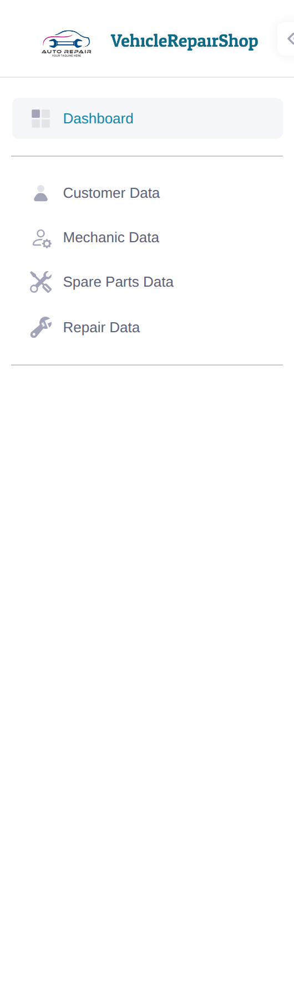

## 2.1 Bagian-Bagian Layar

| Bagian | Letak | Fungsi |
|---|---|---|
| **Menu samping** | Kiri | Berpindah antar modul. Menu yang sedang aktif ditandai dengan latar berwarna |
| **Judul halaman** | Atas tengah | Menunjukkan Anda sedang berada di halaman apa |
| **Jejak navigasi** | Di bawah judul | Menunjukkan posisi Anda, misal *Repair Data • Detail repair*. Dapat diklik untuk kembali |
| **Tombol aksi** | Kanan atas | Tombol utama halaman, misalnya *Edit* atau *Payment* |
| **Tombol tema** | Pojok kanan atas | Ikon matahari untuk berganti antara tampilan terang dan gelap |

## 2.2 Lima Menu Utama

| Menu | Isi |
|---|---|
| 📊 **Dashboard** | Ringkasan seluruh kegiatan bengkel dalam bentuk grafik |
| 👥 **Customer Data** | Data pelanggan beserta kendaraan miliknya |
| 🧑‍🔧 **Mechanic Data** | Data mekanik dan bidang keahliannya |
| 🔩 **Spare Parts Data** | Data sparepart, stok, dan harga |
| 🛠️ **Repair Data** | Data pekerjaan servis dan pembayarannya |

> 💡 **Data kendaraan tidak punya menu sendiri.** Kendaraan selalu dicatat melalui halaman pelanggan pemiliknya — lihat [Bab 5](#5-data-kendaraan).

## 2.3 Cara Kerja Tabel Data

Seluruh tabel dalam aplikasi ini bekerja dengan cara yang sama:

| Elemen | Fungsi |
|---|---|
| **Tombol `+`** di awal baris | Membuka rincian baris tersebut, termasuk **menu aksi** untuk melihat detail atau menghapus |
| **Judul kolom** | Diklik untuk mengurutkan data naik atau turun |
| **Angka `10` di kiri bawah** | Mengatur berapa baris yang ditampilkan per halaman |
| **Angka halaman di kanan bawah** | Berpindah halaman |

> ⚠️ Karena layar hanya menampilkan kolom **Name**, tombol `+` adalah satu-satunya cara membuka rincian dan aksi sebuah baris. Jangan lewatkan tombol kecil ini.

---

# 3. Dashboard

Halaman pertama yang terbuka. Menyajikan kondisi bengkel terkini dalam enam indikator.

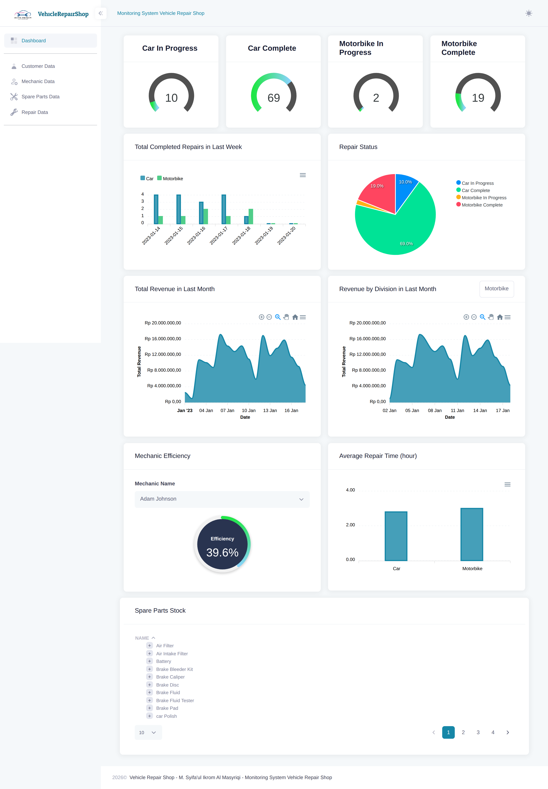

## 3.1 Kartu Status Servis

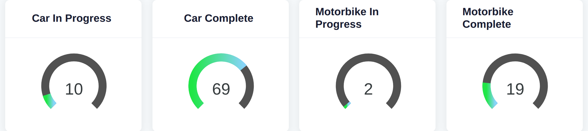

Empat kartu di baris paling atas menunjukkan jumlah pekerjaan servis yang sedang berlangsung dan yang sudah selesai, dipisahkan antara mobil dan motor.

| Kartu | Artinya |
|---|---|
| **Car In Progress** | Mobil yang sedang dikerjakan |
| **Car Complete** | Mobil yang servisnya sudah selesai |
| **Motorbike In Progress** | Motor yang sedang dikerjakan |
| **Motorbike Complete** | Motor yang servisnya sudah selesai |

> 💡 **Kartu ini bisa diklik.** Mengklik salah satu kartu akan membuka daftar servis yang sudah tersaring sesuai kartu tersebut. Ini cara tercepat menjawab pertanyaan *"mobil apa saja yang sedang dikerjakan sekarang?"*

⚡ Keempat kartu ini **memperbarui dirinya sendiri**. Bila petugas lain menambah atau menyelesaikan servis di komputer berbeda, angka di layar Anda ikut berubah tanpa perlu menyegarkan halaman.

## 3.2 Tren Servis dan Komposisi Antrean

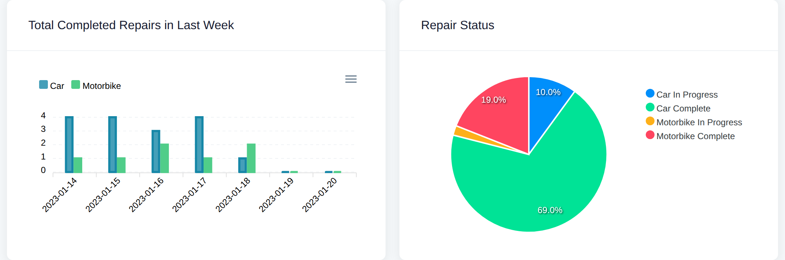

| Grafik | Cara membacanya |
|---|---|
| **Total Completed Repairs in Last Week** | Batang biru = mobil, batang hijau = motor. Menunjukkan berapa servis yang **selesai** pada tujuh tanggal servis terakhir. Berguna untuk melihat hari tersibuk |
| **Repair Status** | Proporsi keempat kombinasi status dan jenis kendaraan dalam bentuk diagram lingkaran. Berguna untuk melihat sekilas apakah antrean menumpuk |

## 3.3 Pendapatan

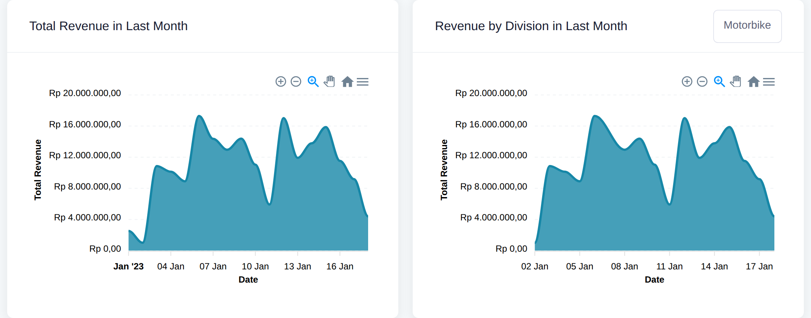

| Grafik | Cara membacanya |
|---|---|
| **Total Revenue in Last Month** | Total pendapatan harian untuk 30 tanggal pembayaran terakhir |
| **Revenue by Division in Last Month** | Pendapatan yang dipisahkan menurut jenis kendaraan. Jenis dipilih lewat kotak pilihan di pojok kanan atas kartu |

> ⚠️ **Angka pada grafik "Revenue by Division" belum dapat dipercaya.** Grafik ini seharusnya hanya menjumlahkan pembayaran untuk jenis kendaraan yang dipilih, tetapi saat ini ia menjumlahkan **seluruh** pembayaran pada tanggal-tanggal tersebut. Gunakan grafik *Total Revenue* untuk angka pendapatan yang benar, dan sampaikan kekeliruan ini kepada petugas teknis.

## 3.4 Efisiensi Mekanik dan Waktu Pengerjaan

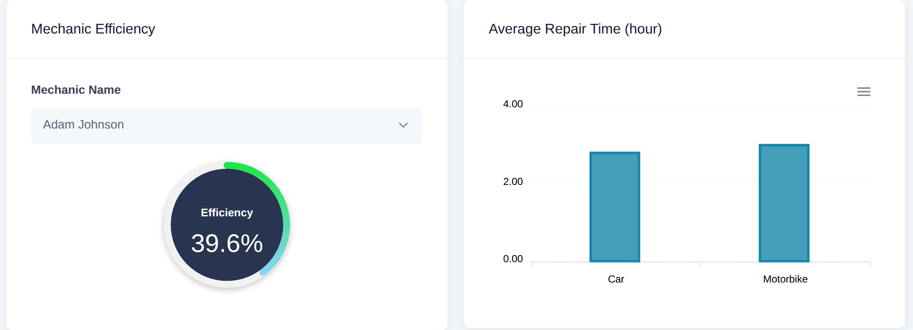

| Grafik | Cara membacanya |
|---|---|
| **Mechanic Efficiency** | Pilih nama mekanik pada kotak pilihan, lalu angka efisiensinya muncul. Dihitung dari jumlah servis yang diselesaikan dibagi total jam kerjanya. **Semakin tinggi semakin baik** |
| **Average Repair Time (hour)** | Rata-rata lama pengerjaan dalam satuan jam, dibandingkan antara mobil dan motor. Berguna untuk memperkirakan janji waktu kepada pelanggan |

> 💡 Angka efisiensi dan rata-rata waktu hanya akurat bila **jam mulai dan jam selesai** setiap servis diisi dengan benar. Lihat [Bab 8.4](#84-memperbarui-servis-dan-statusnya).

## 3.5 Stok Sparepart

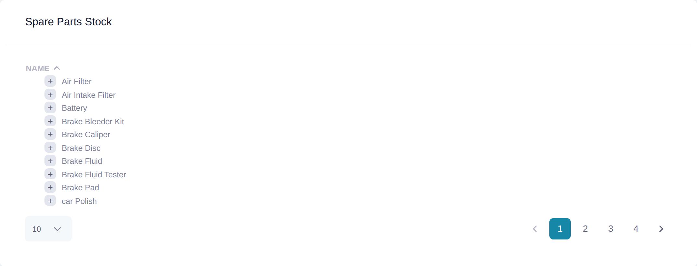

Tabel di bagian bawah dashboard menampilkan sisa stok seluruh sparepart, agar Anda dapat memeriksanya tanpa berpindah menu. Klik judul kolom **STOCK** untuk mengurutkan dari yang paling sedikit — cara cepat menemukan barang yang hampir habis.

> ⚠️ **Sebagian grafik tidak ikut memperbarui diri.** Ketika sebuah servis ditandai selesai, hanya kartu status dan diagram lingkaran yang langsung berubah. Grafik tren, pendapatan, efisiensi, dan rata-rata waktu baru menampilkan angka terbaru **setelah halaman disegarkan** (tekan `F5`).

---

# 4. Data Pelanggan

## 4.1 Melihat Daftar Pelanggan

Klik menu **Customer Data**.

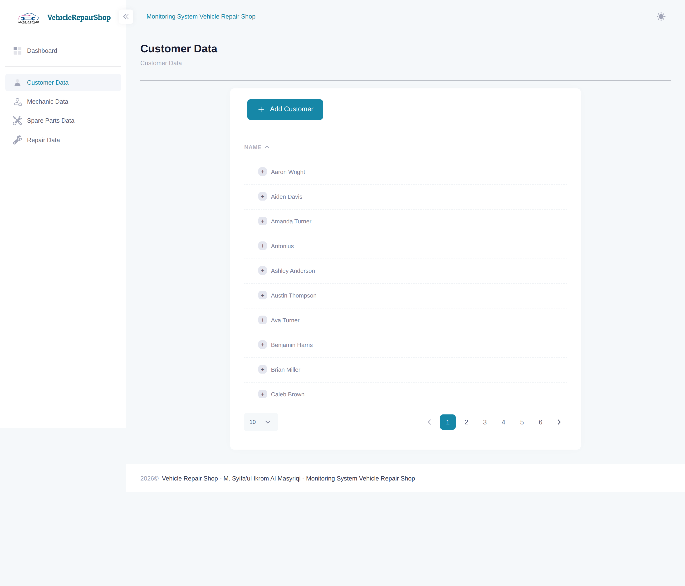

| Elemen | Fungsi |
|---|---|
| **Add Customer** | Membuka formulir pelanggan baru |
| **Kolom NAME** | Nama pelanggan; klik judulnya untuk mengurutkan |
| **Tombol `+`** | Membuka rincian baris dan menu aksi (lihat detail / hapus) |
| **Kotak `10`** | Jumlah baris per halaman |
| **Angka halaman** | Berpindah halaman |

## 4.2 Menambah Pelanggan Baru

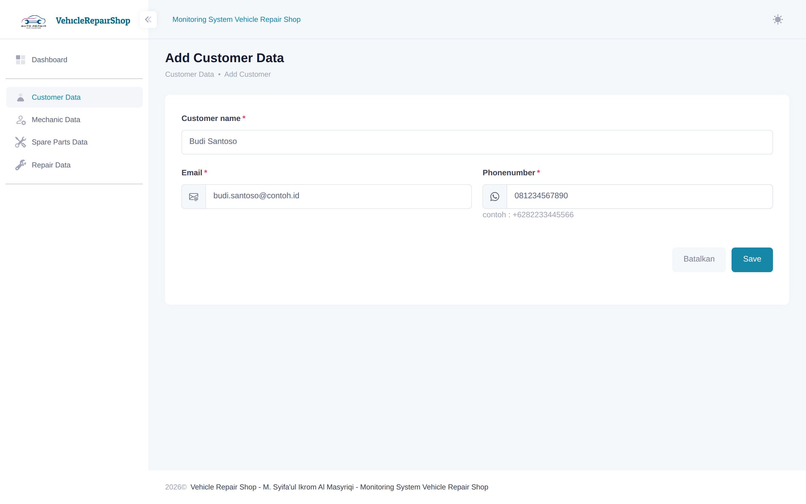

| Kolom | Wajib | Keterangan |
|---|:---:|---|
| **Customer name** | ✅ | Nama lengkap pelanggan |
| **Email** | ✅ | Alamat surel pelanggan |
| **Phone number** | ✅ | Nomor telepon yang bisa dihubungi |

**Langkah:**

1. Klik **Add Customer**.
2. Isi ketiga kolom.
3. Klik **Save**.
4. Aplikasi kembali ke daftar pelanggan disertai pesan keberhasilan.

> ⚠️ **Periksa kembali sebelum menyimpan.** Aplikasi belum memeriksa isian Anda — nomor telepon yang salah ketik atau alamat surel yang tidak sah tetap akan tersimpan.

## 4.3 Melihat Detail Pelanggan

Klik tombol `+` pada baris pelanggan, lalu pilih **Detail**.

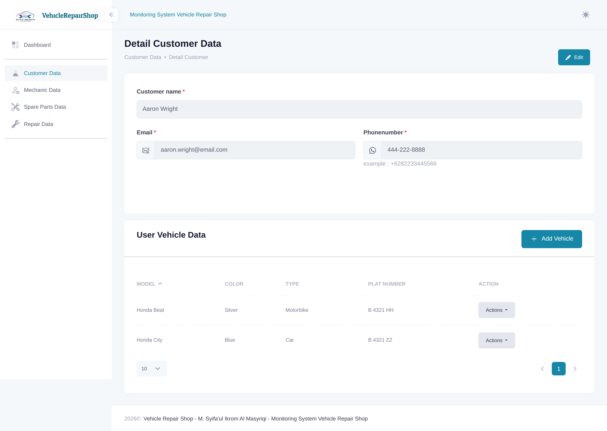

Halaman ini menampilkan identitas pelanggan **beserta daftar kendaraan miliknya**. Dari sinilah kendaraan baru ditambahkan.

## 4.4 Mengubah dan Menghapus Pelanggan

| Aksi | Cara |
|---|---|
| **Mengubah** | Buka detail pelanggan → klik **Edit** → ubah isian → klik **Save** |
| **Menghapus** | Klik `+` pada baris → pilih **Delete** → setujui konfirmasi |

> 🛡️ **Pelanggan yang masih memiliki kendaraan tidak dapat dihapus.** Aplikasi akan menolak dan menampilkan pesan galat. Hapus dulu seluruh kendaraannya, atau biarkan datanya sebagai riwayat.

---

# 5. Data Kendaraan

Kendaraan **tidak memiliki menu tersendiri** karena setiap kendaraan harus memiliki pemilik. Karena itu penambahan kendaraan selalu dimulai dari halaman detail pelanggan.

## 5.1 Menambah Kendaraan

Buka detail pelanggan ([Bab 4.3](#43-melihat-detail-pelanggan)), lalu klik **Add Vehicle**.

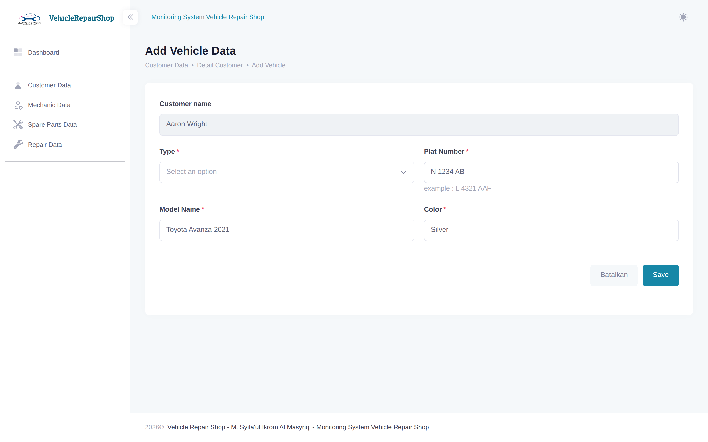

| Kolom | Wajib | Keterangan |
|---|:---:|---|
| **Customer name** | — | Terisi otomatis dan tidak dapat diubah |
| **Model** | ✅ | Merek dan tipe kendaraan, misal `Toyota Avanza 2021` |
| **Color** | ✅ | Warna kendaraan |
| **Type** | ✅ | Pilih **Car** (mobil) atau **Motorbike** (motor) |
| **Plat number** | ✅ | Nomor pelat kendaraan |

**Langkah:**

1. Dari detail pelanggan, klik **Add Vehicle**.
2. Isi model, warna, jenis, dan nomor pelat.
3. Klik **Save**.
4. Aplikasi kembali ke halaman detail pelanggan; kendaraan baru muncul di daftar.

> ⚠️ **Kolom Type menentukan banyak hal.** Jenis kendaraan menentukan sparepart apa saja yang boleh dipakai saat pembayaran, dan masuk ke kelompok mana kendaraan itu dihitung di dashboard. Pastikan pilihannya benar.

## 5.2 Melihat, Mengubah, dan Menghapus Kendaraan

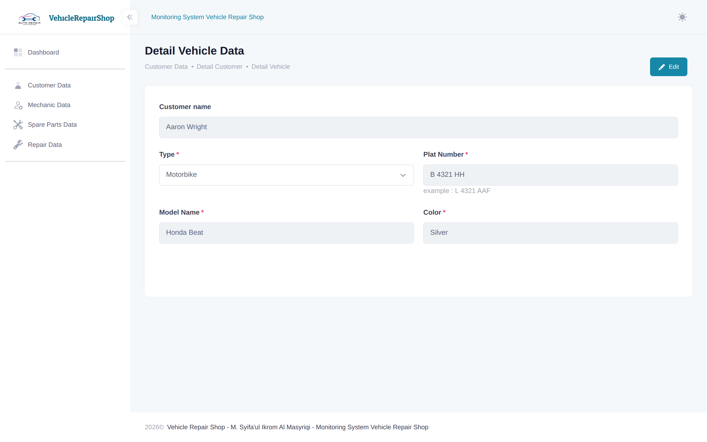

| Aksi | Cara |
|---|---|
| **Melihat** | Klik nama kendaraan pada daftar di halaman detail pelanggan |
| **Mengubah** | Buka detail kendaraan → **Edit** → ubah → **Save** |
| **Menghapus** | Dari daftar kendaraan → menu aksi → **Delete** |

> 🛡️ Kendaraan yang sudah memiliki riwayat servis **tidak dapat dihapus**.

---

# 6. Data Mekanik

## 6.1 Melihat Daftar Mekanik

Klik menu **Mechanic Data**.

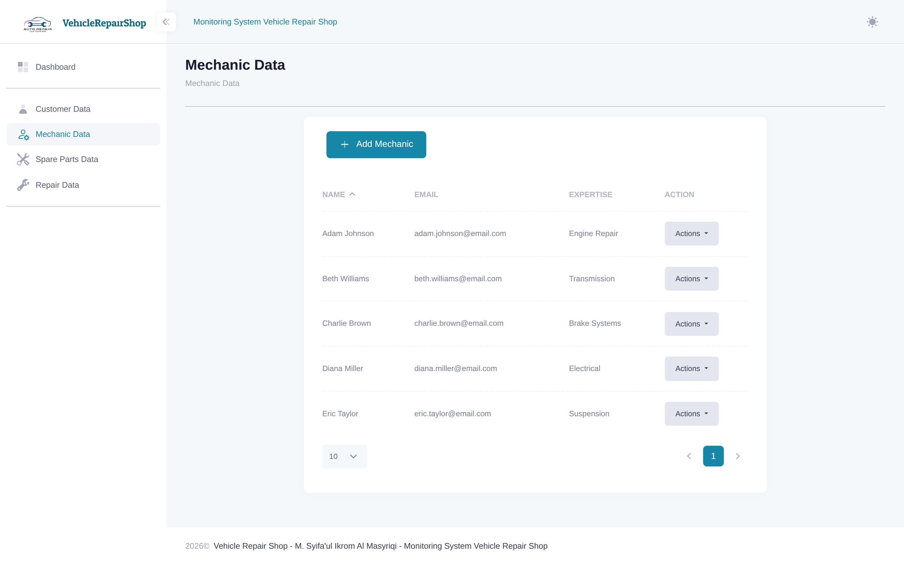

## 6.2 Menambah Mekanik

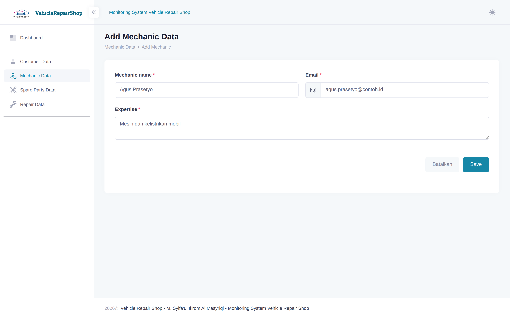

| Kolom | Wajib | Keterangan |
|---|:---:|---|
| **Mechanic name** | ✅ | Nama lengkap mekanik |
| **Email** | ✅ | Alamat surel |
| **Expertise** | ✅ | Bidang keahlian, misal `Mesin dan kelistrikan mobil` |

**Langkah:** klik **Add Mechanic** → isi ketiga kolom → klik **Save**.

> 💡 Isi **Expertise** dengan jelas. Kolom inilah yang membantu Anda memilih mekanik yang tepat saat membuat data servis.

## 6.3 Detail, Ubah, dan Hapus

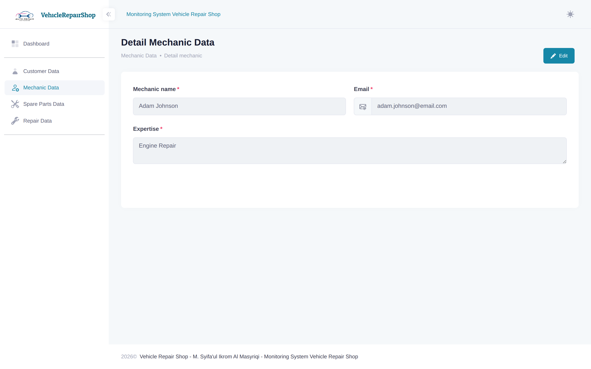

Sama polanya dengan modul pelanggan. Mekanik yang masih tertaut pada data servis **tidak dapat dihapus**.

---

# 7. Data Sparepart

## 7.1 Melihat Daftar Sparepart

Klik menu **Spare Parts Data**.

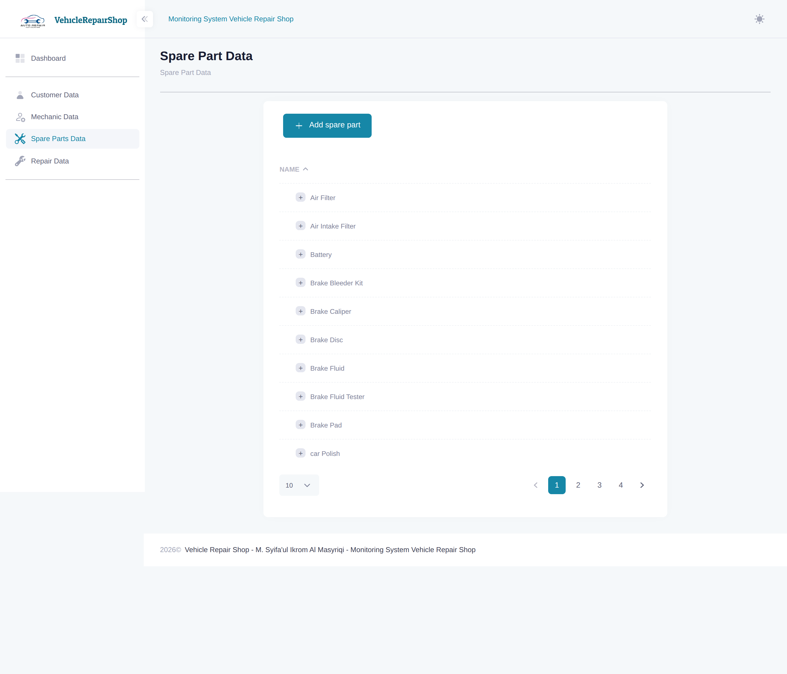

Daftar ini menampilkan nama, jenis kendaraan, stok tersisa, dan harga satuan setiap sparepart.

## 7.2 Menambah Sparepart

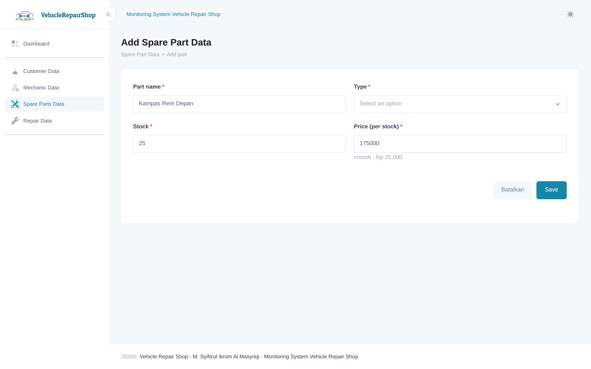

| Kolom | Wajib | Keterangan |
|---|:---:|---|
| **Part name** | ✅ | Nama sparepart, misal `Kampas Rem Depan` |
| **Type** | ✅ | Untuk **Car** atau **Motorbike** |
| **Stock** | ✅ | Jumlah barang yang tersedia saat ini |
| **Price (per stock)** | ✅ | Harga **per satuan**, bukan harga total |

**Langkah:** klik **Add Spare Part** → isi keempat kolom → klik **Save**.

> ⚠️ **Harga diisi per satuan.** Aplikasi mengalikan sendiri dengan jumlah yang dipakai saat menyusun nota. Mengisi harga total akan membuat seluruh nota salah hitung.

## 7.3 Detail dan Penyesuaian Stok

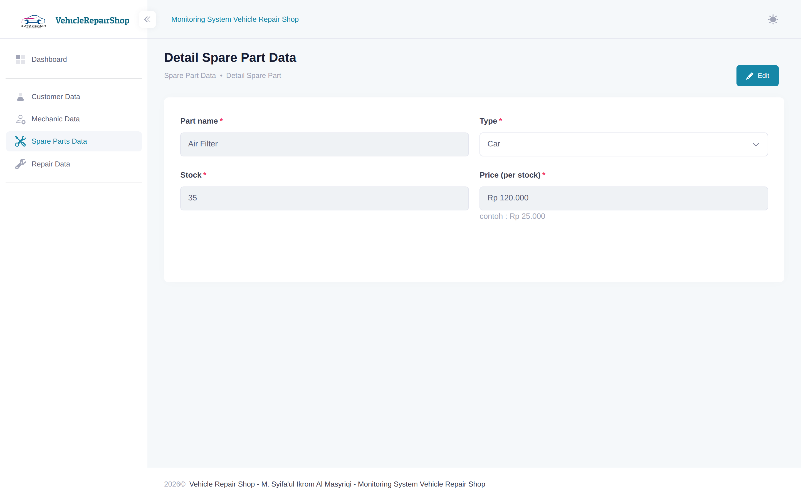

Buka detail sparepart lalu klik **Edit** untuk menyesuaikan stok — misalnya setelah barang baru datang dari pemasok, atau setelah stok opname.

> 💡 **Stok berkurang otomatis** setiap kali sparepart dipakai pada sebuah nota pembayaran. Anda hanya perlu menyesuaikannya secara manual ketika ada barang masuk atau koreksi hitungan.

---

# 8. Data Servis

Modul inti aplikasi. Di sinilah pekerjaan bengkel dicatat dan dipantau.

## 8.1 Melihat Daftar Servis

Klik menu **Repair Data**.

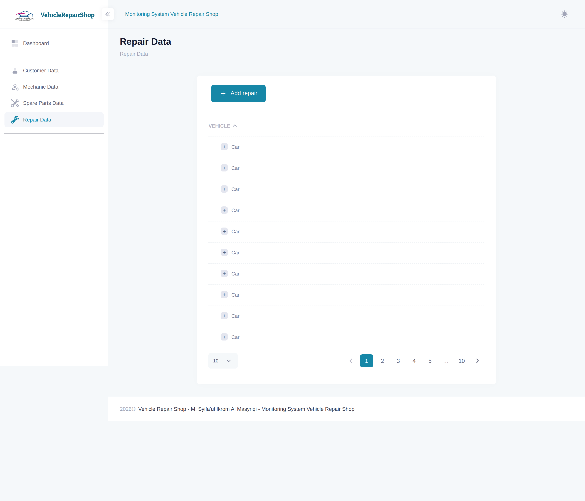

## 8.2 Menyaring Daftar Servis

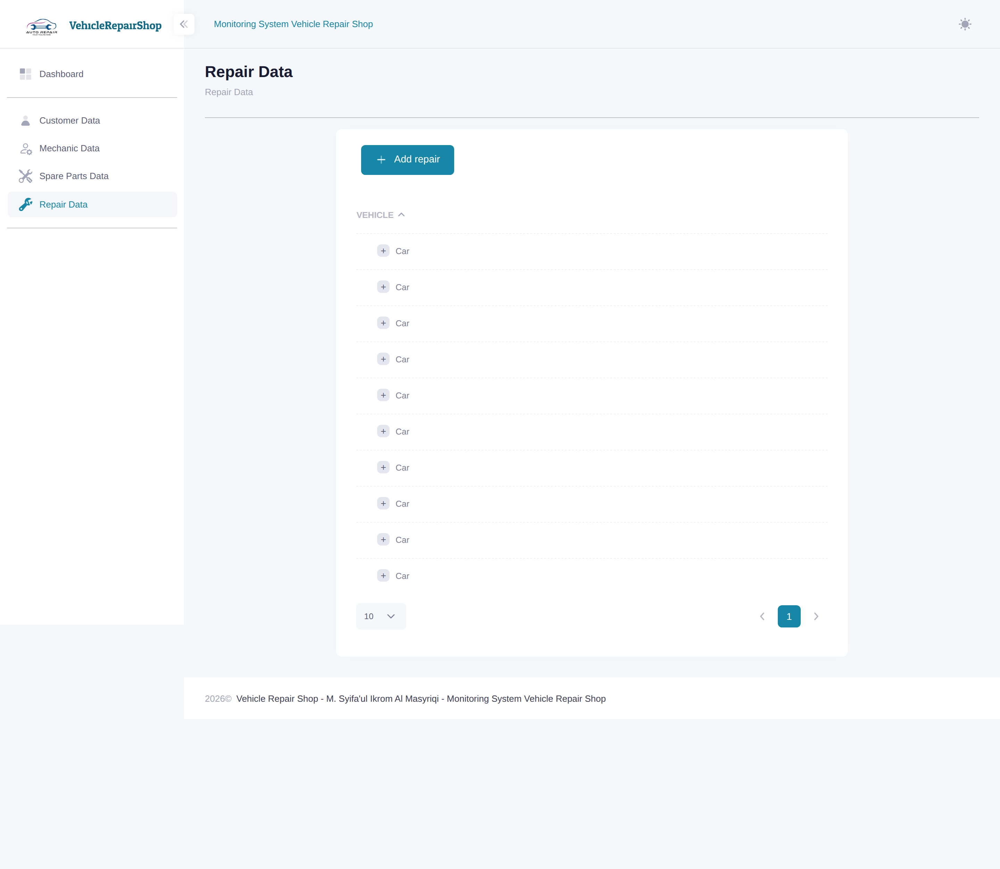

Daftar dapat disaring agar hanya menampilkan kelompok tertentu. Cara termudah: **klik salah satu kartu status di Dashboard** ([Bab 3.1](#31-kartu-status-servis)).

| Kartu yang diklik | Yang ditampilkan |
|---|---|
| Car In Progress | Mobil yang sedang dikerjakan |
| Car Complete | Mobil yang sudah selesai |
| Motorbike In Progress | Motor yang sedang dikerjakan |
| Motorbike Complete | Motor yang sudah selesai |

Untuk kembali melihat seluruh data, klik menu **Repair Data** di menu samping.

## 8.3 Mencatat Servis Baru

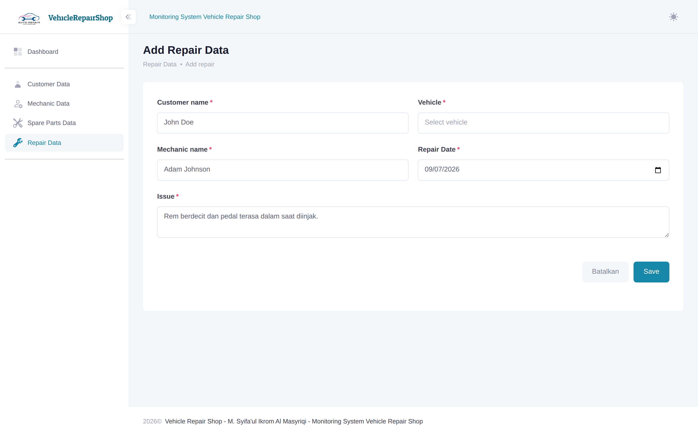

| Kolom | Wajib | Keterangan |
|---|:---:|---|
| **Customer name** | ✅ | Pilih pelanggan. Kotak ini dapat diketik untuk mencari |
| **Vehicle** | ✅ | Kendaraan milik pelanggan tersebut. **Baru bisa dipilih setelah pelanggan ditentukan** |
| **Mechanic name** | ✅ | Mekanik yang akan mengerjakan |
| **Repair Date** | ✅ | Tanggal kendaraan masuk |
| **Issue** | ✅ | Keluhan pelanggan atau kerusakan yang ditemukan |

**Langkah:**

1. Klik **Add Repair**.
2. Pilih **Customer name** lebih dahulu.
3. Pilih **Vehicle** — daftarnya baru terisi setelah pelanggan dipilih.
4. Pilih **Mechanic name** dan isi **Repair Date**.
5. Tulis keluhan pada kolom **Issue** sedetail mungkin.
6. Klik **Save**.

Servis baru otomatis berstatus **In Progress**, dan dashboard seluruh komputer langsung memperbarui angkanya.

> 💡 **Urutannya tidak bisa dibalik.** Kolom *Vehicle* mengambil daftar kendaraan berdasarkan pelanggan yang dipilih. Bila *Customer name* belum diisi, daftar kendaraan akan kosong.
>
> Jika kendaraan pelanggan belum terdaftar, catat dulu kendaraannya lewat [Bab 5.1](#51-menambah-kendaraan).

## 8.4 Memperbarui Servis dan Statusnya

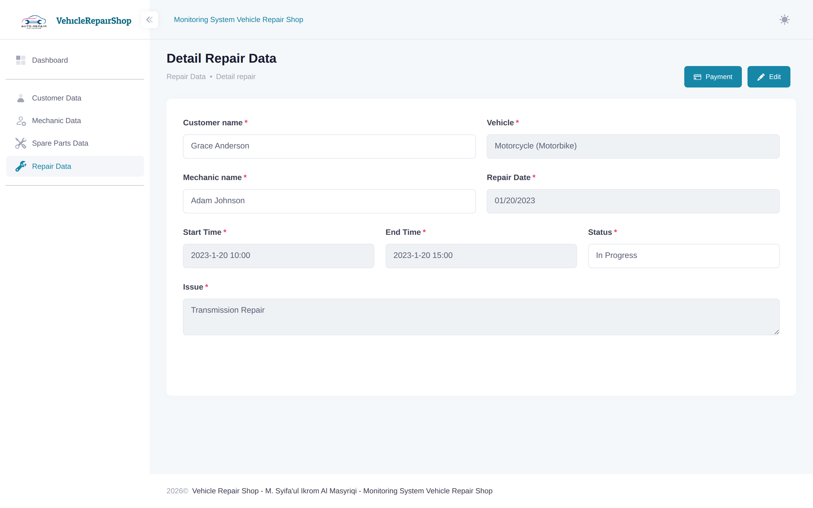

Halaman detail servis menampilkan seluruh data pekerjaan. Isian terkunci sampai Anda menekan tombol **Edit** di kanan atas.

| Kolom | Kapan diisi |
|---|---|
| **Start Time** | Saat mekanik **mulai** mengerjakan |
| **End Time** | Saat pekerjaan **selesai** |
| **Status** | Ubah dari *In Progress* menjadi *Complete* bila pekerjaan sudah rampung |

**Langkah menyelesaikan servis:**

1. Buka detail servis.
2. Klik **Edit**.
3. Isi **Start Time** dan **End Time**.
4. Ubah **Status** menjadi **Complete**.
5. Klik **Save**.

> ⚠️ **Jam mulai dan jam selesai wajib diisi dengan benar.** Kedua nilai inilah yang dipakai menghitung lama pengerjaan, rata-rata waktu servis, dan efisiensi mekanik di dashboard. Bila dikosongkan atau diisi asal, seluruh angka tersebut menjadi keliru.

**Menghapus servis:** dari daftar servis → menu aksi → **Delete**. Servis yang sudah memiliki pembayaran **tidak dapat dihapus**.

---

# 9. Pembayaran

Setelah pekerjaan selesai, susun nota pembayaran. Satu servis hanya boleh memiliki **satu** nota.

## 9.1 Membuka Formulir Pembayaran

Buka detail servis, lalu klik tombol **Payment** di kanan atas.

> 💡 Tombol **Payment** hanya muncul bila servis tersebut **belum** memiliki nota. Bila tombolnya tidak ada, berarti notanya sudah dibuat — lihat [Bab 9.4](#94-mengubah-nota-yang-sudah-tersimpan).

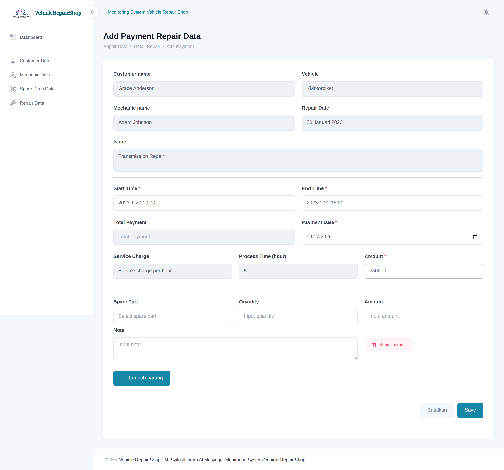

## 9.2 Bagian-Bagian Formulir

**Bagian atas — data servis (hanya untuk dibaca):**

| Kolom | Keterangan |
|---|---|
| Customer name · Vehicle · Mechanic name · Repair Date · Issue | Terisi otomatis dari data servis |

> ℹ️ Kolom **Vehicle** saat ini hanya menampilkan jenis kendaraan dalam kurung, misal `(Motorbike)`, tanpa nama kendaraannya. Ini kekeliruan tampilan yang sudah tercatat; nama kendaraan yang benar dapat dilihat di halaman detail servis.

**Bagian tengah — waktu dan biaya jasa:**

| Kolom | Wajib | Keterangan |
|---|:---:|---|
| **Start Time** | ✅ | Jam mulai pengerjaan; terisi otomatis bila sudah diisi sebelumnya |
| **End Time** | ✅ | Jam selesai pengerjaan |
| **Total Payment** | — | Terisi otomatis; tidak dapat diketik |
| **Payment Date** | ✅ | Tanggal pembayaran diterima |
| **Service Charge** | — | Keterangan tetap: biaya jasa dihitung per jam |
| **Process Time (hour)** | — | Lama pengerjaan; dihitung otomatis dari jam mulai dan selesai |
| **Amount** | ✅ | **Biaya jasa** yang dikenakan. Isi dengan angka saja, misal `250000` |

**Bagian bawah — rincian sparepart:**

| Kolom | Keterangan |
|---|---|
| **Spare Part** | Pilih sparepart yang dipakai. Hanya menampilkan barang yang **stoknya masih ada** dan **sesuai jenis kendaraan** |
| **Quantity** | Jumlah yang dipakai |
| **Amount** | Terisi otomatis dari harga satuan dikalikan jumlah |
| **Note** | Catatan tambahan, misal `Penggantian kampas rem depan` |
| **+ Tambah barang** | Menambah baris sparepart baru |
| **🗑 Hapus barang** | Menghapus baris sparepart tersebut |

## 9.3 Menyimpan Nota

**Langkah:**

1. Periksa **Start Time** dan **End Time**; perbaiki bila perlu.
2. Isi **Payment Date**.
3. Isi **Amount** pada bagian biaya jasa.
4. Untuk setiap sparepart yang dipakai: pilih barangnya, isi jumlahnya, tambahkan catatan bila perlu.
5. Klik **+ Tambah barang** bila sparepart yang dipakai lebih dari satu jenis.
6. Klik **Save**.

**Yang terjadi setelah disimpan:**

- Nota tersimpan berisi satu baris biaya jasa ditambah seluruh baris sparepart
- **Stok setiap sparepart otomatis berkurang** sebanyak jumlah yang dipakai
- Jam mulai dan jam selesai pada data servis ikut diperbarui
- Anda kembali ke halaman detail servis

> 🛡️ **Semua tersimpan sekaligus atau tidak sama sekali.** Bila terjadi kegagalan di tengah proses, seluruh perubahan dibatalkan — termasuk pengurangan stok. Tidak akan ada nota separuh jadi atau stok yang berkurang tanpa nota.

## 9.4 Mengubah Nota yang Sudah Tersimpan

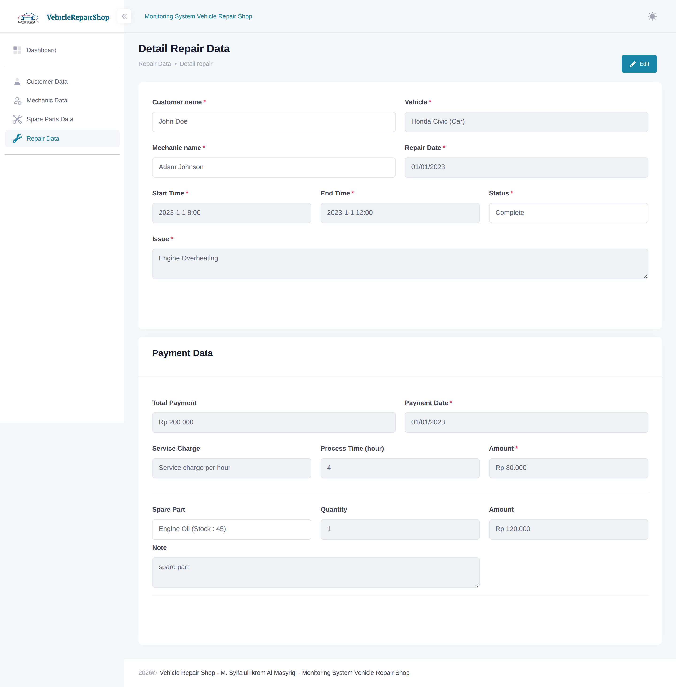

Setelah nota dibuat, rinciannya muncul sebagai bagian **Payment Data** di halaman detail servis dan dapat langsung disunting di sana.

| Yang Anda lakukan | Yang terjadi pada stok |
|---|---|
| **Menambah** baris sparepart | Stok barang tersebut **berkurang** |
| **Menaikkan** jumlah pada baris yang ada | Stok berkurang sebesar selisihnya |
| **Menurunkan** jumlah | Stok **bertambah** kembali sebesar selisihnya |
| **Menghapus** baris sparepart | Seluruh jumlah pada baris itu **dikembalikan** ke stok |

> 💡 **Stok selalu ikut dikoreksi.** Anda tidak perlu menyesuaikan stok secara manual setelah mengubah nota — aplikasi sudah menghitungnya.

---

# 10. Alur Kerja Harian

Berikut satu skenario utuh: seorang pelanggan datang membawa motor dengan keluhan rem berdecit.

| # | Langkah | Menu | Panduan |
|---:|---|---|---|
| 1 | Periksa apakah pelanggan sudah terdaftar | Customer Data | [Bab 4.1](#41-melihat-daftar-pelanggan) |
| 2 | Bila belum, daftarkan pelanggannya | Customer Data → Add Customer | [Bab 4.2](#42-menambah-pelanggan-baru) |
| 3 | Periksa apakah kendaraannya sudah terdaftar | Detail pelanggan | [Bab 4.3](#43-melihat-detail-pelanggan) |
| 4 | Bila belum, daftarkan kendaraannya | Detail pelanggan → Add Vehicle | [Bab 5.1](#51-menambah-kendaraan) |
| 5 | Buat data servis, pilih mekanik, tulis keluhan | Repair Data → Add Repair | [Bab 8.3](#83-mencatat-servis-baru) |
| 6 | Saat mekanik mulai bekerja, isi **Start Time** | Detail servis → Edit | [Bab 8.4](#84-memperbarui-servis-dan-statusnya) |
| 7 | Pantau antrean sepanjang hari | Dashboard | [Bab 3](#3-dashboard) |
| 8 | Setelah selesai, isi **End Time** dan ubah status ke **Complete** | Detail servis → Edit | [Bab 8.4](#84-memperbarui-servis-dan-statusnya) |
| 9 | Susun nota: biaya jasa + sparepart terpakai | Detail servis → Payment | [Bab 9.3](#93-menyimpan-nota) |
| 10 | Sampaikan total kepada pelanggan dan terima pembayaran | — | — |
| 11 | Sebelum tutup, periksa stok yang menipis | Dashboard → tabel Spare Parts Stock | [Bab 3.5](#35-stok-sparepart) |

---

# 11. Pesan Galat yang Mungkin Muncul

| Pesan | Artinya | Yang harus dilakukan |
|---|---|---|
| *Unable to delete a customer because the customer data is already connected to other data* | Pelanggan masih memiliki kendaraan terdaftar | Hapus dulu kendaraannya, atau biarkan data pelanggan sebagai riwayat |
| *Unable to delete a vehicle because the vehicle data is already connected to other data* | Kendaraan sudah punya riwayat servis | Biarkan datanya — riwayat servis sebaiknya memang tidak dihapus |
| *Unable to delete a mechanic because the mechanic data is already connected to other data* | Mekanik masih tertaut pada data servis | Biarkan datanya sebagai riwayat pekerjaan |
| *Unable to delete a repair because the repair data is already connected to other data* | Servis sudah memiliki nota pembayaran | Hapus dulu notanya bila memang perlu dibatalkan |
| *The number of items must not be greater than the stock on hand!* | Jumlah sparepart melebihi stok tersedia | Periksa stok sebenarnya di menu Spare Parts Data, lalu kurangi jumlahnya — atau tambah stok bila barang memang baru datang |
| *The number of items cannot be less than 0!* | Jumlah diisi angka negatif | Isi dengan angka nol atau lebih |
| **419 Page Expired** | Halaman terlalu lama dibiarkan terbuka | Segarkan halaman (`F5`) lalu ulangi pengisian |
| **Halaman putih / grafik kosong** | Sambungan ke server terputus | Segarkan halaman. Bila tetap kosong, hubungi petugas teknis |

---

# 12. Tanya Jawab & Daftar Istilah

## 12.1 Tanya Jawab

**Mengapa daftar kendaraan kosong saat membuat servis?**
Karena kolom *Customer name* belum dipilih. Daftar kendaraan hanya menampilkan milik pelanggan yang dipilih. Bila sudah dipilih dan tetap kosong, berarti kendaraan pelanggan tersebut memang belum terdaftar — catat dulu lewat [Bab 5.1](#51-menambah-kendaraan).

**Mengapa sparepart yang saya cari tidak muncul di formulir pembayaran?**
Ada dua kemungkinan: stoknya sudah habis, atau jenisnya tidak cocok dengan kendaraan yang diservis. Sparepart mobil tidak akan muncul saat menangani motor.

**Bagaimana membatalkan nota yang salah?**
Buka detail servis, lalu ubah bagian *Payment Data* secara langsung. Stok akan ikut dikoreksi otomatis.

**Mengapa angka di dashboard tidak berubah setelah saya menyelesaikan servis?**
Hanya kartu status dan diagram lingkaran yang berubah seketika. Untuk grafik lainnya, segarkan halaman dengan `F5`.

**Bisakah dua petugas bekerja bersamaan di komputer berbeda?**
Bisa. Kartu status di dashboard bahkan saling memperbarui secara langsung. Namun hindari menyunting **data servis yang sama** pada saat bersamaan — perubahan yang disimpan terakhir akan menimpa yang sebelumnya.

**Di mana halaman untuk mengganti kata sandi?**
Belum ada. Aplikasi ini belum memiliki sistem pengguna dan kata sandi — lihat catatan pada [Bab 1.2](#12-sebelum-mulai).

## 12.2 Daftar Istilah

| Istilah di layar | Artinya |
|---|---|
| **Repair** | Satu pekerjaan servis atas satu kendaraan |
| **In Progress** | Servis sedang dikerjakan |
| **Complete** | Servis sudah selesai dikerjakan |
| **Division** | Pengelompokan berdasarkan jenis kendaraan: mobil atau motor |
| **Process Time** | Lama pengerjaan dalam jam, dihitung dari jam mulai ke jam selesai |
| **Service Charge / Amount** | Biaya jasa mekanik, di luar harga sparepart |
| **Spare Part** | Suku cadang yang dipakai saat servis |
| **Stock** | Sisa jumlah sparepart yang tersedia |
| **Efficiency** | Ukuran produktivitas mekanik: servis selesai dibagi total jam kerja |

---

**— Akhir Dokumen —**

[⬆️ Kembali ke atas](#-manual-penggunaan) · [📘 SRS](SRS.md) · [📋 Daftar Fitur](FEATURES.md) · [🗺️ Flowmap](FLOWMAP.md)

