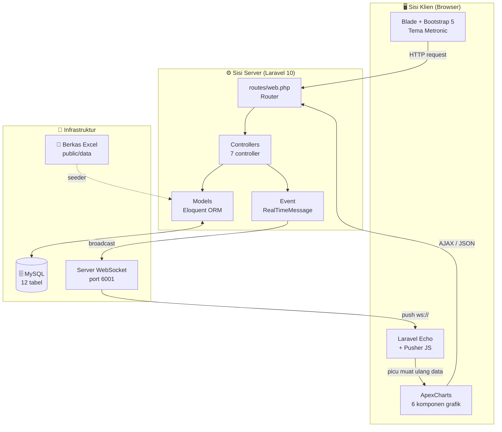
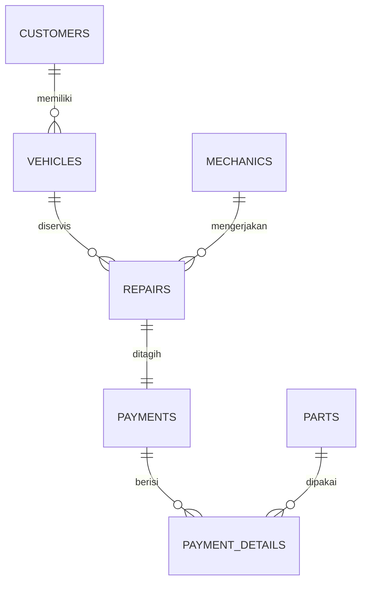

<div align="center">

# 📘 Software Requirement Specification (SRS)

### Monitoring System — Vehicle Repair Shop

</div>

| | |
|---|---|
| **Versi Dokumen** | 1.0 |
| **Tanggal** | 7 September 2026 |
| **Status** | Dokumentasi sistem berjalan (*as-is*) |
| **Basis Kode** | Branch `claude/readme-update-design-y5ctm0` |
| **Standar Acuan** | IEEE Std 830-1998 |
| **Dokumen Terkait** | [Daftar Fitur](FEATURES.md) · [Flowmap](FLOWMAP.md) · [Panduan Instalasi](../README.md#-instalasi) |

> ⚠️ **Cara membaca dokumen ini.** Bab 1–3 hanya memuat kebutuhan yang **sudah benar-benar terimplementasi** di kode. Kebutuhan yang belum dibangun ditempatkan terpisah di [Lampiran A](#lampiran-a--kebutuhan-belum-terimplementasi). Penyimpangan perilaku kode terhadap spesifikasi ideal dicatat di [Lampiran B](#lampiran-b--catatan-implementasi--temuan).

---

## 📑 Daftar Isi

1. [Pendahuluan](#1-pendahuluan)
   - [1.1 Tujuan](#11-tujuan) · [1.2 Ruang Lingkup](#12-ruang-lingkup) · [1.3 Definisi & Akronim](#13-definisi-akronim-dan-singkatan) · [1.4 Referensi](#14-referensi) · [1.5 Sistematika Penulisan](#15-sistematika-penulisan)
2. [Deskripsi Umum](#2-deskripsi-umum)
   - [2.1 Perspektif Produk](#21-perspektif-produk) · [2.2 Fungsi Produk](#22-fungsi-produk) · [2.3 Karakteristik Pengguna](#23-karakteristik-pengguna) · [2.4 Batasan](#24-batasan) · [2.5 Asumsi & Ketergantungan](#25-asumsi-dan-ketergantungan)
3. [Kebutuhan Khusus](#3-kebutuhan-khusus)
   - [3.1 Kebutuhan Antarmuka Eksternal](#31-kebutuhan-antarmuka-eksternal)
   - [3.2 Kebutuhan Fungsional](#32-kebutuhan-fungsional)
   - [3.3 Kebutuhan Non-Fungsional](#33-kebutuhan-non-fungsional)
   - [3.4 Kebutuhan Data](#34-kebutuhan-data)
- [Lampiran A — Kebutuhan Belum Terimplementasi](#lampiran-a--kebutuhan-belum-terimplementasi)
- [Lampiran B — Catatan Implementasi & Temuan](#lampiran-b--catatan-implementasi--temuan)

---

# 1. Pendahuluan

## 1.1 Tujuan

Dokumen ini mendefinisikan kebutuhan perangkat lunak **Monitoring System — Vehicle Repair Shop**, sebuah aplikasi web untuk memantau operasional bengkel kendaraan bermotor. Dokumen ditujukan kepada:

| Pembaca | Kegunaan |
|---|---|
| 👨‍💻 **Pengembang** | Acuan perilaku sistem yang harus dipertahankan saat melakukan perubahan |
| 🧪 **Penguji** | Dasar penyusunan skenario pengujian fungsional |
| 🎓 **Dosen / Pembimbing** | Dokumen spesifikasi formal untuk penilaian |
| 🏪 **Pemilik Bengkel** | Gambaran kemampuan sistem dan batasannya |

## 1.2 Ruang Lingkup

**Nama perangkat lunak:** Monitoring System — Vehicle Repair Shop

Sistem mengelola dan memantau siklus layanan bengkel dari pelanggan mendaftarkan kendaraan hingga pembayaran servis diselesaikan, dengan pembaruan dashboard secara **real-time**.

**Termasuk dalam ruang lingkup:**

- ✅ Pencatatan data induk: pelanggan, kendaraan, mekanik, sparepart
- ✅ Pencatatan dan pemantauan pekerjaan servis (*repair*) beserta statusnya
- ✅ Pencatatan pembayaran beserta rincian jasa dan sparepart, termasuk penyesuaian stok
- ✅ Dashboard analitik enam indikator dengan pembaruan otomatis lewat WebSocket
- ✅ Pemuatan data awal dari berkas Excel melalui *database seeder*

**Tidak termasuk dalam ruang lingkup versi ini:**

- ❌ Autentikasi pengguna dan pembatasan hak akses berbasis peran
- ❌ Antarmuka untuk pelanggan (portal mandiri) maupun mekanik
- ❌ Manajemen multi-cabang bengkel
- ❌ Integrasi *payment gateway* dan pencetakan nota
- ❌ Aplikasi seluler

## 1.3 Definisi, Akronim, dan Singkatan

| Istilah | Penjelasan |
|---|---|
| **Repair / Servis** | Satu pekerjaan perbaikan atas satu kendaraan oleh satu mekanik |
| **Division** | Pengelompokan berdasarkan jenis kendaraan: `car` (mobil) atau `motorbike` (motor) |
| **Process Time** | Lama pengerjaan servis dalam satuan jam desimal, dihitung dari `start_time` ke `end_time` |
| **Payment Detail** | Satu baris rincian pembayaran; berisi biaya jasa **atau** satu jenis sparepart |
| **Broadcasting** | Mekanisme Laravel untuk menyiarkan *event* server ke browser lewat WebSocket |
| **Channel `events`** | Kanal publik WebSocket tempat sistem menyiarkan pemberitahuan perubahan data |
| **CRUD** | *Create, Read, Update, Delete* |
| **SRS** | *Software Requirement Specification* |
| **ORM** | *Object Relational Mapping* (Eloquent pada Laravel) |

## 1.4 Referensi

1. IEEE Std 830-1998 — *IEEE Recommended Practice for Software Requirements Specifications*
2. [Dokumentasi Laravel 10](https://laravel.com/docs/10.x)
3. [Laravel WebSockets — BeyondCode](https://beyondco.de/docs/laravel-websockets)
4. [ApexCharts Documentation](https://apexcharts.com/docs)
5. Kode sumber proyek — branch `claude/readme-update-design-y5ctm0`

## 1.5 Sistematika Penulisan

- **Bab 1** menjelaskan tujuan, ruang lingkup, dan istilah yang dipakai.
- **Bab 2** memaparkan gambaran umum sistem: posisi produk, fungsi utama, pengguna, batasan, dan asumsi.
- **Bab 3** memuat kebutuhan rinci: antarmuka eksternal, kebutuhan fungsional bernomor, kebutuhan non-fungsional, dan kebutuhan data.
- **Lampiran** memuat rencana pengembangan serta catatan penyimpangan implementasi.

---

# 2. Deskripsi Umum

## 2.1 Perspektif Produk

Sistem merupakan aplikasi web mandiri (*standalone*) berbasis arsitektur **MVC Laravel**, tidak menjadi bagian dari sistem lain yang lebih besar. Karakteristik yang membedakannya dari aplikasi CRUD biasa adalah adanya **jalur komunikasi kedua**: selain siklus HTTP *request-response*, sistem membuka kanal WebSocket agar perubahan data langsung terdorong ke seluruh browser yang sedang membuka dashboard.



## 2.2 Fungsi Produk

| # | Kelompok Fungsi | Ringkasan |
|---|---|---|
| F1 | 📊 **Dashboard Analitik** | Menyajikan enam indikator operasional bengkel dalam bentuk grafik |
| F2 | 👥 **Manajemen Pelanggan** | Mencatat identitas pelanggan beserta kendaraan miliknya |
| F3 | 🚙 **Manajemen Kendaraan** | Mencatat kendaraan dan mengaitkannya dengan pemilik |
| F4 | 🧑‍🔧 **Manajemen Mekanik** | Mencatat mekanik dan bidang keahliannya |
| F5 | 🔩 **Manajemen Sparepart** | Mencatat sparepart, jenis, stok, dan harga |
| F6 | 🛠️ **Manajemen Servis** | Mencatat pekerjaan servis dan memperbarui statusnya |
| F7 | 🧾 **Pembayaran** | Menyusun rincian biaya jasa dan sparepart serta menyesuaikan stok |
| F8 | ⚡ **Notifikasi Real-Time** | Menyiarkan perubahan data servis agar dashboard ikut berubah tanpa refresh |

## 2.3 Karakteristik Pengguna

### Aktor sistem

| Aktor | Deskripsi | Hak Akses | Kemampuan Teknis |
|---|---|---|---|
| 🧑‍💼 **Admin / Front Office** | Petugas bengkel yang mengoperasikan seluruh aplikasi | **Penuh atas seluruh modul** | Mampu mengoperasikan aplikasi web perkantoran |

> 🔓 **Catatan penting.** Pada versi berjalan, sistem **tidak memiliki mekanisme autentikasi**. Seluruh route pada `routes/web.php` dapat diakses siapa pun yang mengetahui alamatnya. Karena itu hanya terdapat satu aktor sistem. Pemisahan peran menjadi Admin, Kasir, dan Mekanik dicatat sebagai kebutuhan mendatang pada [Lampiran A](#lampiran-a--kebutuhan-belum-terimplementasi).

### Aktor bisnis (di luar sistem)

| Aktor | Peran dalam alur kerja |
|---|---|
| 🙋 **Pelanggan** | Menyerahkan kendaraan dan menyampaikan keluhan; datanya dicatatkan oleh Admin |
| 🧑‍🔧 **Mekanik** | Mengerjakan servis secara fisik; kemajuan pekerjaannya dicatatkan oleh Admin |

## 2.4 Batasan

| Kode | Batasan |
|---|---|
| **BT-01** | Sistem tidak memiliki autentikasi maupun otorisasi; seluruh halaman bersifat publik |
| **BT-02** | Masukan pengguna tidak divalidasi di sisi server; keandalan data bergantung pada kedisiplinan operator dan validasi HTML sisi klien |
| **BT-03** | Hanya mendukung dua jenis kendaraan: `car` dan `motorbike` (tipe kolom `enum`) |
| **BT-04** | Hanya mendukung basis data MySQL/MariaDB karena pemakaian kolom bertipe `enum` |
| **BT-05** | Fitur real-time mensyaratkan proses `php artisan websockets:serve` berjalan; tanpa itu dashboard tetap berfungsi namun tidak memperbarui diri |
| **BT-06** | Satu pekerjaan servis hanya boleh memiliki satu pembayaran (relasi *one-to-one*) |
| **BT-07** | Sistem melayani satu bengkel; tidak ada konsep cabang atau multi-tenant |
| **BT-08** | Antarmuka menggunakan bahasa Inggris, sedangkan format tanggal memakai lokal Indonesia (`isoFormat` locale `id`) |

## 2.5 Asumsi dan Ketergantungan

**Asumsi**

- Data pelanggan, mekanik, dan sparepart telah lebih dulu tersedia sebelum pencatatan servis.
- Operator memasukkan `start_time` dan `end_time` secara benar; seluruh perhitungan durasi dan efisiensi bergantung pada kedua nilai tersebut.
- Aplikasi dijalankan pada jaringan lokal bengkel yang tepercaya — asumsi ini menjadi dasar batasan **BT-01**.

**Ketergantungan**

| Ketergantungan | Versi | Konsekuensi bila tidak terpenuhi |
|---|---|---|
| PHP | ≥ 8.1 | Aplikasi gagal dijalankan |
| Ekstensi PHP `zip` & `gd` | — | Seeder Excel gagal membaca berkas `.xlsx` |
| MySQL / MariaDB | ≥ 5.7 / 10.3 | Migrasi kolom `enum` gagal |
| Node.js & Vite | 16+ / 4.x | Aset CSS/JS tidak terbangun, tampilan rusak |
| `beyondcode/laravel-websockets` | ^1.14 | Fitur real-time tidak berfungsi |
| `maatwebsite/excel` | ^3.1 | Seeder tidak dapat dijalankan |

---

# 3. Kebutuhan Khusus

## 3.1 Kebutuhan Antarmuka Eksternal

### 3.1.1 Antarmuka Pengguna

| Elemen | Ketentuan |
|---|---|
| **Tema** | Metronic (Bootstrap 5), aset statis pada `public/assets` |
| **Tata letak** | Sidebar kiri + header atas + area konten (`resources/views/layouts/app.blade.php`) |
| **Menu navigasi** | Lima butir: Dashboard · Customer Data · Mechanic Data · Spare Parts Data · Repair Data (`resources/views/components/sidebar.blade.php`) |
| **Grafik** | ApexCharts — jenis *radial gauge*, *pie*, *bar*, dan *area* |
| **Tabel data** | DataTables v1.13.1 dengan pencarian, pengurutan, dan paginasi |
| **Umpan balik aksi** | SweetAlert2 melalui paket `realrashid/sweet-alert` |
| **Mode tampilan** | Terang dan gelap; warna grafik menyesuaikan mode aktif melalui `KTThemeMode.getMode()` |
| **Responsivitas** | Mengikuti sistem grid Bootstrap 5 |

### 3.1.2 Antarmuka Perangkat Keras

Tidak ada ketergantungan perangkat keras khusus. Sistem berjalan pada peladen atau komputer biasa yang mampu menjalankan PHP dan MySQL; klien cukup memakai peramban modern yang mendukung WebSocket.

### 3.1.3 Antarmuka Perangkat Lunak

| Antarmuka | Keterangan |
|---|---|
| **Basis data** | MySQL melalui PDO; koneksi diatur pada `config/database.php` |
| **Berkas Excel** | `maatwebsite/excel` membaca `public/data/*.xlsx` pada saat *seeding* |
| **Server WebSocket** | Protokol Pusher; konfigurasi pada `config/websockets.php` dan `config/broadcasting.php` |

### 3.1.4 Antarmuka Komunikasi

| Aspek | Nilai |
|---|---|
| Protokol aplikasi | HTTP/HTTPS |
| Protokol real-time | WebSocket (`ws://` atau `wss://`), kompatibel Pusher |
| Porta bawaan aplikasi | `8000` (`php artisan serve`) |
| Porta bawaan WebSocket | `6001` (`LARAVEL_WEBSOCKETS_PORT`) |
| Kanal siaran | `events` — kanal **publik**, otorisasi pada `routes/channels.php` selalu mengembalikan `true` |
| Format pertukaran data | JSON |

## 3.2 Kebutuhan Fungsional

Penomoran kebutuhan dikelompokkan per modul:

| Blok | Modul | Berkas sumber |
|---|---|---|
| `SRS-F-1xx` | Dashboard & Analitik | `app/Http/Controllers/DashboardController.php` |
| `SRS-F-2xx` | Manajemen Pelanggan | `app/Http/Controllers/CustomerController.php` |
| `SRS-F-3xx` | Manajemen Kendaraan | `app/Http/Controllers/VehicleController.php` |
| `SRS-F-4xx` | Manajemen Mekanik | `app/Http/Controllers/MechanicsController.php` |
| `SRS-F-5xx` | Manajemen Sparepart | `app/Http/Controllers/PartController.php` |
| `SRS-F-6xx` | Manajemen Servis | `app/Http/Controllers/RepairController.php` |
| `SRS-F-7xx` | Pembayaran | `app/Http/Controllers/PaymentController.php` |
| `SRS-F-8xx` | Notifikasi Real-Time | `app/Events/RealTimeMessage.php` |

Keterangan status: ✅ Terimplementasi penuh · ⚠️ Terimplementasi sebagian

---

### 📊 SRS-F-1xx — Dashboard & Analitik

#### `SRS-F-101` — Menampilkan Kartu Status Servis

| Aspek | Uraian |
|---|---|
| **Deskripsi** | Sistem menampilkan empat kartu berisi jumlah pekerjaan servis, hasil persilangan status servis dengan jenis kendaraan: *Car In Progress*, *Car Complete*, *Motorbike In Progress*, *Motorbike Complete* |
| **Aktor** | Admin |
| **Masukan** | — (dimuat otomatis saat halaman dibuka) |
| **Proses** | Menghitung `Repair` berdasarkan `status` (`1` = In Progress, `2` = Complete) dan `Vehicle.type` (`car` / `motorbike`) |
| **Keluaran** | Larik JSON empat bilangan bulat, ditampilkan sebagai grafik *radial* |
| **Referensi** | `DashboardController@getDataStatus` · route `GET /getDataStatus` |
| **Status** | ✅ |

#### `SRS-F-102` — Menyaring Daftar Servis dari Kartu Status

| Aspek | Uraian |
|---|---|
| **Deskripsi** | Setiap kartu status dapat diklik untuk membuka daftar servis yang sudah tersaring sesuai kartu tersebut |
| **Aktor** | Admin |
| **Masukan** | Klik pada kartu |
| **Proses** | Mengalihkan ke `repair.index` dengan parameter kueri `car_progress`, `car_complete`, `motor_progress`, atau `motor_complete` bernilai `1` |
| **Keluaran** | Halaman daftar servis yang telah tersaring |
| **Referensi** | `resources/views/home.blade.php` · `RepairController@index` |
| **Status** | ✅ |

#### `SRS-F-103` — Menampilkan Komposisi Antrean Servis

| Aspek | Uraian |
|---|---|
| **Deskripsi** | Menyajikan proporsi keempat kombinasi status–jenis kendaraan dalam bentuk diagram lingkaran |
| **Masukan** | — |
| **Proses** | Memakai kembali data `SRS-F-101` |
| **Keluaran** | Diagram lingkaran dengan empat irisan |
| **Referensi** | `DashboardController@index` (variabel `$data_status`) · elemen `#pie_chart` |
| **Status** | ✅ |

#### `SRS-F-104` — Menampilkan Tren Servis Selesai Tujuh Hari Terakhir

| Aspek | Uraian |
|---|---|
| **Deskripsi** | Menyajikan jumlah servis berstatus *Complete* per tanggal untuk tujuh tanggal servis terakhir, dipisahkan mobil dan motor |
| **Masukan** | — |
| **Proses** | Mengambil tujuh nilai `repair_date` unik terbaru, lalu menghitung servis `status = 2` per tanggal untuk tiap jenis kendaraan; hasil dibalik agar urut menaik |
| **Keluaran** | JSON `{ date, car, motor }` untuk grafik batang |
| **Referensi** | `DashboardController@getCompleteRepairs` · route `GET /getCompleteRepairs` |
| **Status** | ✅ |

#### `SRS-F-105` — Menghitung Efisiensi Mekanik

| Aspek | Uraian |
|---|---|
| **Deskripsi** | Menampilkan skor efisiensi seorang mekanik yang dipilih dari daftar |
| **Masukan** | `mechanic_id` |
| **Proses** | `efisiensi = (jumlah servis selesai ÷ total jam pengerjaan) × 100`, dibulatkan satu angka desimal |
| **Keluaran** | Satu bilangan pada grafik *gauge* |
| **Referensi** | `DashboardController@getMechanicEfficient` · route `GET /getMechanicEfficient` |
| **Status** | ⚠️ Berpotensi galat pembagian nol — lihat [B-2](#lampiran-b--catatan-implementasi--temuan). Grafiknya sendiri sempat tidak pernah tampil hingga [B-7](#lampiran-b--catatan-implementasi--temuan) diperbaiki |

#### `SRS-F-106` — Menghitung Rata-Rata Waktu Pengerjaan

| Aspek | Uraian |
|---|---|
| **Deskripsi** | Menampilkan rata-rata lama pengerjaan servis mobil dan motor dalam satuan jam |
| **Masukan** | — |
| **Proses** | Menjumlahkan `process_time` seluruh servis yang `start_time` dan `end_time`-nya terisi, lalu dibagi jumlah servis; `process_time` dihitung dengan `Carbon::floatDiffInHours()` |
| **Keluaran** | Larik JSON `[waktu_mobil, waktu_motor]`, dibulatkan satu angka desimal |
| **Referensi** | `DashboardController@getAverageTime` · `Repair::getProcessTimeAttribute` · route `GET /getAverageTime` |
| **Status** | ✅ |

#### `SRS-F-107` — Menampilkan Pendapatan 30 Hari Terakhir

| Aspek | Uraian |
|---|---|
| **Deskripsi** | Menyajikan total pendapatan harian untuk 30 tanggal pembayaran terakhir, serta pendapatan yang dipisahkan per jenis kendaraan |
| **Masukan** | `type` (`car` / `motorbike`) untuk deret per divisi |
| **Proses** | Menjumlahkan kolom `total` pada tabel `payments` per tanggal |
| **Keluaran** | JSON `{ total_payment_data, total_revenue_data }` berisi pasangan koordinat `{x, y}` |
| **Referensi** | `DashboardController@getRevenueData` · route `GET /getRevenueData` |
| **Status** | ⚠️ Deret per divisi belum tersaring jenis kendaraan — lihat [B-1](#lampiran-b--catatan-implementasi--temuan). Grafiknya sendiri sempat tidak pernah tampil hingga [B-7](#lampiran-b--catatan-implementasi--temuan) diperbaiki |

#### `SRS-F-108` — Menyesuaikan Warna Grafik dengan Mode Tampilan

| Aspek | Uraian |
|---|---|
| **Deskripsi** | Warna seluruh grafik menyesuaikan mode terang atau gelap yang sedang aktif |
| **Masukan** | Perubahan mode tema |
| **Proses** | Fungsi `getColorMode()` membaca `KTThemeMode.getMode()`, lalu memanggil `chart.updateOptions()` |
| **Keluaran** | Grafik tergambar ulang dengan palet warna yang sesuai |
| **Referensi** | `resources/views/home.blade.php` |
| **Status** | ✅ |

---

### 👥 SRS-F-2xx — Manajemen Pelanggan

| ID | Kebutuhan | Deskripsi | Referensi | Status |
|---|---|---|---|---|
| `SRS-F-201` | Menampilkan daftar pelanggan | Seluruh pelanggan disajikan dalam tabel DataTables | `CustomerController@index` · `GET /customer` | ✅ |
| `SRS-F-202` | Menambah pelanggan | Menyimpan nama, surel, dan nomor telepon | `CustomerController@create`, `@store` | ✅ |
| `SRS-F-203` | Menampilkan detail pelanggan | Menampilkan identitas pelanggan beserta daftar kendaraan miliknya | `CustomerController@show` · `GET /customer/{id}` | ✅ |
| `SRS-F-204` | Mengubah data pelanggan | Memutakhirkan nama, surel, dan nomor telepon | `CustomerController@update` | ✅ |
| `SRS-F-205` | Menghapus pelanggan | Penghapusan dijalankan dalam transaksi; bila pelanggan masih memiliki kendaraan, transaksi dibatalkan dan pesan galat ditampilkan | `CustomerController@destroy` | ✅ |

> Masukan pada `SRS-F-202` dan `SRS-F-204` tidak divalidasi di sisi server (batasan **BT-02**).

---

### 🚙 SRS-F-3xx — Manajemen Kendaraan

| ID | Kebutuhan | Deskripsi | Referensi | Status |
|---|---|---|---|---|
| `SRS-F-301` | Menambah kendaraan pada pelanggan | Formulir dibuka dari halaman detail pelanggan dengan parameter `customer_id`; menyimpan model, warna, jenis, dan nomor pelat | `VehicleController@create`, `@store` | ✅ |
| `SRS-F-302` | Menampilkan detail kendaraan | Menampilkan atribut kendaraan beserta pemiliknya | `VehicleController@show` | ✅ |
| `SRS-F-303` | Mengubah data kendaraan | Memutakhirkan model, warna, jenis, dan nomor pelat | `VehicleController@update` | ✅ |
| `SRS-F-304` | Menghapus kendaraan | Dibatalkan bila kendaraan masih memiliki riwayat servis | `VehicleController@destroy` | ✅ |
| `SRS-F-305` | Mencari kendaraan milik pelanggan | Endpoint JSON untuk komponen pilihan bertingkat pada formulir servis; menerima `customer_id` dan kata kunci `search` | `VehicleController@getVehicleByCustomer` · `GET /vehicles` | ✅ |

---

### 🧑‍🔧 SRS-F-4xx — Manajemen Mekanik

| ID | Kebutuhan | Deskripsi | Referensi | Status |
|---|---|---|---|---|
| `SRS-F-401` | Menampilkan daftar mekanik | Seluruh mekanik disajikan dalam tabel | `MechanicsController@index` · `GET /mechanic` | ✅ |
| `SRS-F-402` | Menambah mekanik | Menyimpan nama, surel, dan bidang keahlian | `MechanicsController@create`, `@store` | ✅ |
| `SRS-F-403` | Menampilkan detail mekanik | Menampilkan profil mekanik | `MechanicsController@show` | ✅ |
| `SRS-F-404` | Mengubah data mekanik | Memutakhirkan nama, surel, dan keahlian | `MechanicsController@update` | ✅ |
| `SRS-F-405` | Menghapus mekanik | Dibatalkan bila mekanik masih tertaut pada data servis | `MechanicsController@destroy` | ✅ |

---

### 🔩 SRS-F-5xx — Manajemen Sparepart

| ID | Kebutuhan | Deskripsi | Referensi | Status |
|---|---|---|---|---|
| `SRS-F-501` | Menampilkan daftar sparepart | Menampilkan nama, jenis, stok, dan harga satuan | `PartController@index` · `GET /part` | ✅ |
| `SRS-F-502` | Menambah sparepart | Menyimpan nama, jenis (`car`/`motorbike`), stok, dan harga | `PartController@create`, `@store` | ✅ |
| `SRS-F-503` | Menampilkan detail sparepart | Menampilkan atribut satu sparepart | `PartController@show` | ✅ |
| `SRS-F-504` | Mengubah data sparepart | Memutakhirkan atribut termasuk penyesuaian stok manual | `PartController@update` | ✅ |
| `SRS-F-505` | Menghapus sparepart | Dibatalkan bila sparepart pernah dipakai pada rincian pembayaran | `PartController@destroy` | ✅ |
| `SRS-F-506` | Menyaring sparepart sesuai jenis kendaraan | Pada formulir pembayaran, hanya sparepart dengan `stock > 0` dan jenis yang sama dengan kendaraan yang ditawarkan | `PaymentController@create` · `RepairController@show` | ✅ |

---

### 🛠️ SRS-F-6xx — Manajemen Servis

#### `SRS-F-601` — Menampilkan Daftar Servis dengan Penyaringan

| Aspek | Uraian |
|---|---|
| **Deskripsi** | Menampilkan daftar pekerjaan servis; dapat disaring berdasarkan kombinasi status dan jenis kendaraan |
| **Masukan** | Parameter kueri opsional: `car_progress`, `car_complete`, `motor_progress`, `motor_complete` |
| **Proses** | Menyusun kueri secara kondisional memakai `when()`; tanpa parameter, seluruh data ditampilkan |
| **Keluaran** | Tabel daftar servis |
| **Referensi** | `RepairController@index` · `GET /repair` |
| **Status** | ✅ |

#### `SRS-F-602` — Mencatat Servis Baru

| Aspek | Uraian |
|---|---|
| **Deskripsi** | Mencatat pekerjaan servis baru atas kendaraan seorang pelanggan |
| **Masukan** | `vehicle_id` (dipilih bertingkat setelah pelanggan), `mechanic_id`, `issue`, `repair_date` |
| **Proses** | Menyimpan data `Repair` dengan `status` bawaan `1` (In Progress), lalu menyiarkan event `RealTimeMessage('status')` |
| **Keluaran** | Data servis tersimpan; dashboard seluruh klien diperbarui |
| **Referensi** | `RepairController@store` · `POST /repair` |
| **Status** | ✅ |

#### `SRS-F-603` — Menampilkan Detail Servis

| Aspek | Uraian |
|---|---|
| **Deskripsi** | Menampilkan rincian servis, formulir penyuntingan, serta bagian data pembayaran bila pembayaran sudah dibuat |
| **Masukan** | `id` servis |
| **Proses** | Memuat data servis beserta pelanggan, mekanik, sparepart yang layak, dan menghitung `process_time` |
| **Keluaran** | Halaman detail servis |
| **Referensi** | `RepairController@show` · `GET /repair/{id}` |
| **Status** | ✅ |

#### `SRS-F-604` — Memperbarui Servis dan Statusnya

| Aspek | Uraian |
|---|---|
| **Deskripsi** | Memperbarui data servis, termasuk jam mulai, jam selesai, dan perubahan status menjadi *Complete* |
| **Masukan** | `vehicle_id`, `mechanic_id`, `issue`, `repair_date`, `start_time`, `end_time`, `status` |
| **Proses** | Menyimpan perubahan, lalu menyiarkan event `RealTimeMessage('status')` |
| **Keluaran** | Data terbarui; seluruh dashboard menyesuaikan diri |
| **Referensi** | `RepairController@update` · `PUT /repair/{id}` |
| **Status** | ✅ |

#### `SRS-F-605` — Menghapus Servis

| Aspek | Uraian |
|---|---|
| **Deskripsi** | Menghapus data servis |
| **Proses** | Dijalankan dalam transaksi; dibatalkan bila servis sudah memiliki pembayaran |
| **Keluaran** | Data terhapus, atau pesan galat bila terhalang relasi |
| **Referensi** | `RepairController@destroy` · `DELETE /repair/{id}` |
| **Status** | ✅ |

---

### 🧾 SRS-F-7xx — Pembayaran

#### `SRS-F-701` — Membuka Formulir Pembayaran

| Aspek | Uraian |
|---|---|
| **Deskripsi** | Membuka formulir pembayaran untuk satu pekerjaan servis |
| **Masukan** | `repair_id` |
| **Proses** | Memuat data servis, menghitung `process_time`, menyiapkan daftar sparepart yang bersesuaian, serta menetapkan tanggal servis sebagai batas minimum tanggal pembayaran |
| **Keluaran** | Halaman formulir pembayaran |
| **Referensi** | `PaymentController@create` · `GET /payment/create` |
| **Status** | ⚠️ Label kendaraan tampil tidak lengkap — lihat [Lampiran B-3](#lampiran-b--catatan-implementasi--temuan) |

#### `SRS-F-702` — Menyimpan Pembayaran dan Menyesuaikan Stok

| Aspek | Uraian |
|---|---|
| **Deskripsi** | Menyimpan pembayaran beserta seluruh rincian, sekaligus mengurangi stok sparepart yang terpakai |
| **Masukan** | `repair_id`, `start_time`, `end_time`, `payment_date`, `service_amount`, `process_time`, serta daftar `repeater` berisi `part_id`, `quantity`, `amount`, `note` |
| **Proses** | Dalam satu transaksi basis data: **(a)** memutakhirkan jam mulai dan jam selesai servis, **(b)** membuat satu `Payment`, **(c)** membuat satu `PaymentDetail` berketerangan `service cost`, **(d)** membuat satu `PaymentDetail` untuk tiap sparepart, **(e)** mengurangi `Part.stock` sebesar kuantitas yang dipakai |
| **Keluaran** | Data pembayaran tersimpan, stok tersesuaikan; pengguna dialihkan ke halaman detail servis |
| **Aturan** | Nilai rupiah bertanda `Rp` dan pemisah ribuan dinormalisasi menjadi bilangan bulat sebelum disimpan |
| **Penanganan galat** | Kegagalan apa pun memicu `rollback`; pesan galat dikembalikan ke halaman sebelumnya |
| **Referensi** | `PaymentController@store` · `POST /payment` | 
| **Status** | ✅ |

#### `SRS-F-703` — Mengubah Pembayaran dan Mengembalikan Stok

| Aspek | Uraian |
|---|---|
| **Deskripsi** | Mengubah pembayaran yang sudah tersimpan, termasuk menambah, mengubah, dan menghapus baris rincian |
| **Masukan** | `id` pembayaran, `total`, `payment_date`, `service_detail_id`, `process_time`, `service_amount`, dan daftar `repeater` |
| **Proses** | Dalam satu transaksi: **(a)** memutakhirkan `Payment` dan rincian biaya jasa, **(b)** untuk baris yang dihapus, **stok sparepart dikembalikan** lalu baris rinciannya dihapus, **(c)** untuk baris baru dan baris yang berubah, stok dihitung ulang dan disesuaikan |
| **Aturan validasi** | Kuantitas melebihi stok tersedia ditolak dengan pesan *"The number of items must not be greater than the stock on hand!"*; kuantitas negatif ditolak dengan pesan *"The number of items cannot be less than 0!"* |
| **Keluaran** | Pembayaran terbarui dan stok konsisten |
| **Referensi** | `PaymentController@update` · `PUT /payment/{id}` |
| **Status** | ✅ |

#### `SRS-F-704` — Menampilkan Pembayaran pada Detail Servis

| Aspek | Uraian |
|---|---|
| **Deskripsi** | Rincian pembayaran ditampilkan dan dapat disunting langsung dari halaman detail servis |
| **Proses** | Blade memeriksa relasi `Repair::payment`; bagian pembayaran hanya dirender bila relasi terisi |
| **Referensi** | `resources/views/repairs/show.blade.php` |
| **Status** | ✅ |

> ℹ️ Route `payment.index`, `payment.show`, `payment.edit`, dan `payment.destroy` terdaftar sebagai *resource route*, tetapi method pengendalinya masih kosong — lihat [Lampiran B-4](#lampiran-b--catatan-implementasi--temuan).

---

### ⚡ SRS-F-8xx — Notifikasi Real-Time

#### `SRS-F-801` — Menyiarkan Perubahan Data Servis

| Aspek | Uraian |
|---|---|
| **Deskripsi** | Setiap pembuatan atau perubahan data servis disiarkan ke seluruh klien yang terhubung |
| **Masukan** | Pemanggilan `event(new RealTimeMessage('status'))` |
| **Proses** | Event mengimplementasikan `ShouldBroadcast` dan disiarkan pada kanal publik `events` |
| **Keluaran** | Pesan WebSocket diterima seluruh klien |
| **Referensi** | `app/Events/RealTimeMessage.php` · `RepairController@store`, `@update` · `routes/channels.php` |
| **Status** | ✅ |

#### `SRS-F-802` — Memperbarui Dashboard secara Otomatis

| Aspek | Uraian |
|---|---|
| **Deskripsi** | Dashboard memperbarui indikator statusnya begitu menerima siaran bermuatan `status`, tanpa perlu menyegarkan halaman |
| **Masukan** | Pesan WebSocket pada kanal `events` |
| **Proses** | `Echo.channel('events').listen('RealTimeMessage', ...)` memanggil `getData()`, yang meminta ulang **satu endpoint** yaitu `GET /getDataStatus` |
| **Keluaran** | Empat kartu status dan diagram lingkaran tergambar ulang dengan data terkini |
| **Cakupan** | ⚠️ Terbatas pada `SRS-F-101` dan `SRS-F-103`. Grafik tren, pendapatan, efisiensi mekanik, dan rata-rata waktu **tidak ikut diperbarui** — lihat [B-6](#lampiran-b--catatan-implementasi--temuan) |
| **Referensi** | `resources/views/home.blade.php` (fungsi `getData`) · `resources/js/bootstrap.js` |
| **Status** | ⚠️ |

---

### 🌱 SRS-F-9xx — Pemuatan Data Awal

| ID | Kebutuhan | Deskripsi | Referensi | Status |
|---|---|---|---|---|
| `SRS-F-901` | Memuat data contoh dari Excel | `php artisan migrate --seed` mengimpor tujuh berkas `.xlsx` dari `public/data` ke tabel yang bersesuaian, dengan urutan yang menghormati relasi antar tabel | `database/seeders/*` · `app/Imports/*` | ✅ |

---

## 3.3 Kebutuhan Non-Fungsional

| ID | Kategori | Kebutuhan | Status Pemenuhan |
|---|---|---|---|
| `SRS-NF-01` | ⚡ **Kinerja** | Pembaruan indikator status pada dashboard diterima klien dalam waktu ≤ 2 detik pada jaringan lokal | ✅ Terpenuhi lewat siaran WebSocket, namun cakupannya terbatas — lihat `SRS-F-802` |
| `SRS-NF-02` | ⚡ **Kinerja** | Halaman dashboard tampil sepenuhnya dalam waktu wajar pada data berskala bengkel kecil–menengah | ⚠️ Terpenuhi pada data contoh, namun endpoint `getCompleteRepairs` dan `getRevenueData` menjalankan kueri di dalam perulangan sehingga waktu tanggap tumbuh linear terhadap jumlah tanggal |
| `SRS-NF-03` | 🔒 **Keamanan** | Sistem membatasi akses hanya kepada pengguna berwenang | ❌ **Belum terpenuhi** — tidak ada autentikasi (batasan **BT-01**); rencana pemenuhan pada `SRS-F-F01` |
| `SRS-NF-04` | 🔒 **Keamanan** | Seluruh formulir terlindung dari CSRF | ✅ Terpenuhi melalui middleware `VerifyCsrfToken` bawaan Laravel |
| `SRS-NF-05` | 🔒 **Keamanan** | Kueri basis data aman dari injeksi SQL | ✅ Terpenuhi melalui *prepared statement* Eloquent |
| `SRS-NF-06` | 🛡️ **Keandalan** | Operasi yang menyentuh banyak tabel bersifat atomik | ✅ Terpenuhi — `DB::beginTransaction`/`rollback` pada seluruh proses pembayaran dan penghapusan |
| `SRS-NF-07` | 🛡️ **Keandalan** | Penghapusan data yang masih dirujuk data lain harus dicegah dan disampaikan sebagai pesan yang dapat dipahami | ✅ Terpenuhi melalui *foreign key constraint* dan blok `try–catch` |
| `SRS-NF-08` | 🎨 **Kebergunaan** | Setiap aksi memberi umpan balik keberhasilan atau kegagalan | ✅ Terpenuhi melalui SweetAlert dan pesan `withErrors` |
| `SRS-NF-09` | 🎨 **Kebergunaan** | Antarmuka mendukung mode terang dan gelap | ✅ Terpenuhi |
| `SRS-NF-10` | 📦 **Portabilitas** | Sistem dapat dipasang pada Windows, Linux, maupun macOS dengan tumpukan PHP–MySQL standar | ✅ Terpenuhi |
| `SRS-NF-11` | 🧹 **Pemeliharaan** | Kode mengikuti gaya penulisan PSR-12 | ⚠️ `laravel/pint` tersedia sebagai dependensi pengembangan, namun belum dijalankan secara rutin |
| `SRS-NF-12` | 🧪 **Keteruji** | Perilaku inti sistem terlindungi oleh pengujian otomatis | ❌ **Belum terpenuhi** — hanya tersedia `ExampleTest` bawaan Laravel |

## 3.4 Kebutuhan Data

### 3.4.1 Diagram Relasi Entitas



### 3.4.2 Kamus Data

#### Tabel `customers` — Data Pelanggan

| Kolom | Tipe | Null | Keterangan |
|---|---|:---:|---|
| `id` | `bigint unsigned` | ❌ | Kunci utama, auto increment |
| `name` | `varchar(255)` | ❌ | Nama pelanggan |
| `phone_number` | `varchar(255)` | ❌ | Nomor telepon |
| `email` | `varchar(255)` | ❌ | Alamat surel |
| `created_at`, `updated_at` | `timestamp` | ✅ | Stempel waktu Laravel |

#### Tabel `vehicles` — Data Kendaraan

| Kolom | Tipe | Null | Keterangan |
|---|---|:---:|---|
| `id` | `bigint unsigned` | ❌ | Kunci utama |
| `customer_id` | `bigint unsigned` | ✅ | Kunci tamu → `customers.id` |
| `model` | `varchar(255)` | ❌ | Model kendaraan |
| `color` | `varchar(255)` | ❌ | Warna kendaraan |
| `type` | `enum('car','motorbike')` | ❌ | Jenis kendaraan; menentukan divisi |
| `plat_number` | `varchar(255)` | ❌ | Nomor pelat |
| `created_at`, `updated_at` | `timestamp` | ✅ | Stempel waktu |

#### Tabel `mechanics` — Data Mekanik

| Kolom | Tipe | Null | Keterangan |
|---|---|:---:|---|
| `id` | `bigint unsigned` | ❌ | Kunci utama |
| `name` | `varchar(255)` | ❌ | Nama mekanik |
| `email` | `varchar(255)` | ❌ | Alamat surel |
| `expertise` | `text` | ❌ | Bidang keahlian |
| `created_at`, `updated_at` | `timestamp` | ✅ | Stempel waktu |

#### Tabel `parts` — Data Sparepart

| Kolom | Tipe | Null | Keterangan |
|---|---|:---:|---|
| `id` | `bigint unsigned` | ❌ | Kunci utama |
| `name` | `varchar(255)` | ❌ | Nama sparepart |
| `type` | `enum('car','motorbike')` | ❌ | Peruntukan jenis kendaraan |
| `stock` | `int` | ❌ | Jumlah stok tersedia |
| `price` | `double` | ❌ | Harga per satuan stok |
| `created_at`, `updated_at` | `timestamp` | ✅ | Stempel waktu |

#### Tabel `repairs` — Data Servis

| Kolom | Tipe | Null | Keterangan |
|---|---|:---:|---|
| `id` | `bigint unsigned` | ❌ | Kunci utama |
| `vehicle_id` | `bigint unsigned` | ✅ | Kunci tamu → `vehicles.id` |
| `mechanic_id` | `bigint unsigned` | ✅ | Kunci tamu → `mechanics.id` |
| `issue` | `text` | ❌ | Keluhan atau kerusakan |
| `repair_date` | `date` | ❌ | Tanggal servis |
| `start_time` | `datetime` | ✅ | Waktu mulai pengerjaan |
| `end_time` | `datetime` | ✅ | Waktu selesai pengerjaan |
| `status` | `int` | ❌ | `1` = In Progress (bawaan), `2` = Complete |
| `created_at`, `updated_at` | `timestamp` | ✅ | Stempel waktu |

**Atribut turunan (tidak disimpan):**

| Atribut | Perhitungan |
|---|---|
| `process_time` | `floatDiffInHours(start_time, end_time)`; bernilai `0` bila salah satu waktu kosong |
| `date_repair` | `repair_date` diformat `D MMMM Y` dengan lokal Indonesia |

#### Tabel `payments` — Data Pembayaran

| Kolom | Tipe | Null | Keterangan |
|---|---|:---:|---|
| `id` | `bigint unsigned` | ❌ | Kunci utama |
| `repair_id` | `bigint unsigned` | ✅ | Kunci tamu → `repairs.id`, relasi satu-ke-satu |
| `total` | `double` | ❌ | Total tagihan, bawaan `0` |
| `payment_date` | `date` | ❌ | Tanggal pembayaran |
| `created_at`, `updated_at` | `timestamp` | ✅ | Stempel waktu |

**Atribut turunan:** `date_payment` — `payment_date` diformat `D MMMM Y` dengan lokal Indonesia.

#### Tabel `payment_details` — Rincian Pembayaran

| Kolom | Tipe | Null | Keterangan |
|---|---|:---:|---|
| `id` | `bigint unsigned` | ❌ | Kunci utama |
| `payment_id` | `bigint unsigned` | ✅ | Kunci tamu → `payments.id` |
| `part_id` | `bigint unsigned` | ✅ | Kunci tamu → `parts.id`; **bernilai `NULL` pada baris biaya jasa** |
| `quantity` | `double` | ❌ | Kuantitas sparepart, atau lama pengerjaan pada baris biaya jasa |
| `amount` | `double` | ❌ | Nilai baris = harga satuan × kuantitas |
| `note` | `text` | ✅ | Keterangan; bernilai `service cost` pada baris biaya jasa |
| `created_at`, `updated_at` | `timestamp` | ✅ | Stempel waktu |

#### Tabel Pendukung Kerangka Kerja

| Tabel | Kegunaan |
|---|---|
| `users` | Tabel pengguna bawaan Laravel — **tersedia namun belum digunakan** karena autentikasi belum aktif |
| `password_reset_tokens` | Token pengaturan ulang kata sandi (belum digunakan) |
| `personal_access_tokens` | Token API Laravel Sanctum (belum digunakan) |
| `failed_jobs` | Catatan pekerjaan antrean yang gagal |
| `websockets_statistics_entries` | Statistik server WebSocket |

---

# Lampiran A — Kebutuhan Belum Terimplementasi

Kebutuhan berikut **belum ada di dalam kode**. Bagian ini berfungsi sebagai *backlog* pengembangan, disusun menurut prioritas.

## A.1 Prioritas Tinggi

| ID | Kebutuhan | Alasan | Status |
|---|---|---|---|
| `SRS-F-F01` | **Autentikasi pengguna** — halaman masuk, keluar, dan sesi | Seluruh data operasional dan keuangan bengkel saat ini terbuka bagi siapa pun yang mengetahui alamat halaman | ❌ |
| `SRS-F-F02` | **Otorisasi berbasis peran** — Admin, Kasir, Mekanik dengan kewenangan berbeda | Kasir tidak seharusnya dapat mengubah data induk; mekanik cukup memutakhirkan status pekerjaannya | ❌ |
| `SRS-F-F03` | **Validasi masukan sisi server** memakai *Form Request* | Data tidak valid saat ini dapat tersimpan dan merusak perhitungan dashboard | ❌ |
| `SRS-F-F04` | **Pencatatan jejak audit** atas perubahan data pembayaran dan stok | Penyesuaian stok tidak dapat ditelusuri siapa dan kapan pelakunya | ❌ |

## A.2 Prioritas Menengah

| ID | Kebutuhan | Manfaat | Status |
|---|---|---|---|
| `SRS-F-F05` | **Ekspor laporan** servis dan pendapatan ke Excel atau PDF | Rekap bulanan siap cetak; pustaka `maatwebsite/excel` sudah tersedia | ❌ |
| `SRS-F-F06` | **Peringatan stok menipis** dengan ambang batas per sparepart | Mencegah kehabisan stok saat pengerjaan berlangsung | ❌ |
| `SRS-F-F07` | **Penyaringan dashboard menurut rentang tanggal** | Saat ini periode terkunci pada 7 dan 30 hari terakhir | ❌ |
| `SRS-F-F08` | **Pencetakan nota pembayaran** | Pelanggan memerlukan bukti pembayaran tercetak | ❌ |
| `SRS-F-F09` | **Penjadwalan dan antrean servis** memakai FullCalendar | Pustaka sudah tersedia pada tema; membantu pemerataan beban mekanik | ❌ |

## A.3 Prioritas Rendah

| ID | Kebutuhan | Manfaat | Status |
|---|---|---|---|
| `SRS-F-F10` | **Pemberitahuan kepada pelanggan** melalui WhatsApp atau surel saat servis selesai | Meningkatkan mutu layanan | ❌ |
| `SRS-F-F11` | **Riwayat servis per kendaraan** pada halaman detail kendaraan | Memudahkan penelusuran kerusakan berulang | ❌ |
| `SRS-F-F12` | **Manajemen multi-cabang** | Diperlukan bila bengkel berkembang | ❌ |

---

# Lampiran B — Catatan Implementasi & Temuan

Bagian ini mencatat **selisih antara perilaku kode saat ini dengan spesifikasi yang semestinya**, hasil telaah kode. Seluruh butir merupakan temuan dokumentasi; **tidak ada perubahan kode yang dilakukan bersamaan dengan penyusunan dokumen ini**.

### B-1 · Deret pendapatan per divisi tidak tersaring jenis kendaraan

**Terkait:** `SRS-F-107` · **Berkas:** `app/Http/Controllers/DashboardController.php` (method `getRevenueData`) · **Dampak:** 🔴 Tinggi

Penyaringan jenis kendaraan hanya diterapkan saat **mengambil daftar tanggal**, sedangkan penjumlahan nilainya mengabaikan penyaringan tersebut:

```php
$payment = Payment::whereHas('repair', function($query) use($request){
    $query->whereHas('vehicle', function($query) use($request){
        $query->where('type', $request->type);   // ← penyaringan hanya sampai di sini
    });
});
$revenue_date = $payment->orderBy('payment_date','desc')->distinct('payment_date')->take(30)->pluck('payment_date')->toArray();

foreach($revenue_date as $date){
    $revenue = Payment::where('payment_date', $date)->sum('total');   // ← seluruh pembayaran ikut terjumlah
}
```

**Akibat:** grafik *"revenue by division"* menampilkan angka yang sama dengan grafik pendapatan total. Ini merupakan galat yang tidak kasat mata — grafik tetap tergambar wajar sehingga kekeliruannya sukar disadari.

**Saran perbaikan:** sertakan penyaringan jenis kendaraan pada penjumlahan, misalnya dengan `Payment::whereHas('repair.vehicle', fn($q) => $q->where('type', $request->type))->where('payment_date', $date)->sum('total')`.

---

### B-2 · Pembagian dengan nol pada perhitungan efisiensi mekanik

**Terkait:** `SRS-F-105` · **Berkas:** `app/Http/Controllers/DashboardController.php` (method `getMechanicEfficient`) · **Dampak:** 🟠 Menengah

```php
$efficiency = ($complete_repair / $total_time_spent) * 100;
```

Bila mekanik yang dipilih belum memiliki servis selesai — atau seluruh servisnya belum terisi `start_time`/`end_time` — maka `$total_time_spent` bernilai `0` dan perhitungan menghasilkan `INF` atau `NAN`.

**Saran perbaikan:** kembalikan nilai `0` lebih awal ketika `$total_time_spent` bernilai `0`, mengikuti pola penjagaan yang sudah diterapkan pada `getAverageTime()`.

---

### B-3 · Label kendaraan pada formulir pembayaran tidak lengkap

**Terkait:** `SRS-F-701` · **Berkas:** `app/Http/Controllers/PaymentController.php` (method `create`) · **Dampak:** 🟡 Rendah

```php
$vehicle = $repair->vehicle->name . " (" . $repair->vehicle->type_text . ")";
```

Model `Vehicle` tidak memiliki kolom maupun *accessor* bernama `name`; kolom yang tersedia adalah `model`. Akibatnya label kendaraan tampil hanya sebagai `" (Car)"` tanpa nama kendaraan.

**Saran perbaikan:** gunakan `$repair->vehicle->model`, sejalan dengan `VehicleController@getVehicleByCustomer` yang sudah memakai kolom tersebut.

---

### B-4 · Route pembayaran yang belum berisi implementasi

**Terkait:** `SRS-F-7xx` · **Berkas:** `app/Http/Controllers/PaymentController.php` · **Dampak:** 🟡 Rendah

`Route::resource('payment', PaymentController::class)` mendaftarkan tujuh route, namun method `index()`, `show()`, `edit()`, dan `destroy()` masih berisi badan kosong. Mengakses `GET /payment` menghasilkan halaman kosong tanpa pesan galat.

**Saran perbaikan:** persempit pendaftaran route dengan `->only(['create','store','update'])`, atau lengkapi method yang masih kosong.

---

### B-5 · Event debug yang tertinggal

**Terkait:** `SRS-F-801` · **Berkas:** `app/Http/Controllers/CustomerController.php` (method `index`) · **Dampak:** 🟡 Rendah

```php
event(new RealTimeMessage('Hello World! I am an event 😄'));
```

Siaran ini terpicu setiap kali halaman daftar pelanggan dibuka. Muatannya diabaikan oleh pendengar di dashboard — yang hanya menanggapi pesan bernilai `status` — sehingga tidak menimbulkan kesalahan tampilan, namun tetap menghasilkan lalu lintas WebSocket yang tidak diperlukan.

**Saran perbaikan:** hapus baris tersebut.

### B-7 · Tiga grafik dashboard tidak pernah tampil — **sudah diperbaiki**

**Terkait:** `SRS-F-105`, `SRS-F-106`, `SRS-F-107` · **Berkas:** `resources/views/home.blade.php` · **Dampak:** 🔴 Tinggi · **Status:** ✅ **Sudah diperbaiki**

`KTThemeMode.getMode()` dipanggil di badan skrip dashboard, padahal bundel tema menjalankan `KTThemeMode.init()` di dalam `onDOMContentLoaded(...)`. Skrip dashboard berada di badan halaman sehingga dieksekusi **saat dokumen masih diurai** — sebelum `DOMContentLoaded`. Akibatnya pemanggilan itu melempar `TypeError: Cannot read properties of undefined (reading 'hasAttribute')`, dan **seluruh baris setelahnya dalam blok skrip yang sama tidak pernah dijalankan**.

Bukti dari probe yang disisipkan tepat sebelum baris tersebut:

```
PROBE readyState=loading  KTThemeModeInit=undefined
PAGE ERROR: Cannot read properties of undefined (reading 'hasAttribute')
✅ #bar_chart                                     (didefinisikan sebelum baris bermasalah)
❌ #revenue_chart  ❌ #mechanic_chart  ❌ #average_chart   (sesudahnya)
```

**Dampak bagi pengguna:** grafik *Total Revenue*, *Revenue by Division*, *Mechanic Efficiency*, dan *Average Repair Time* **selalu kosong**. Hanya kartu status, diagram lingkaran, dan grafik tren yang tampil. Bug bersifat deterministik — dialami setiap pengguna, bukan akibat lingkungan tertentu. Diuji pula dengan seluruh sumber daya CDN dipenuhi konten lokal: galat tetap muncul.

**Perbaikan yang diterapkan:** ditambahkan helper `getThemeMode()` yang membaca atribut `data-theme` pada elemen akar — atribut yang sudah disetel skrip inline di `<head>` layout, jauh sebelum badan halaman diurai — dengan `KTThemeMode.getMode()` sebagai cadangan. Seluruh pemanggilan `KTThemeMode.getMode()` di `home.blade.php` diarahkan ke helper tersebut.

Sekalian diperbaiki cacat sejalur: `getColorMode(mode)` pada pembuatan grafik batang dipanggil sebelum variabel `mode` terisi, sehingga selalu menerima `undefined` dan salah warna pada render pertama di mode gelap.

**Terverifikasi setelah perbaikan:** nol `pageerror`; ketujuh elemen grafik tergambar; pergantian mode gelap tetap berfungsi (`data-theme` berubah, label sumbu menjadi putih).

> ⚠️ **Koreksi atas dokumentasi sebelumnya.** Versi awal SRS dan FEATURES menyatakan keenam grafik dashboard berfungsi. Pernyataan itu keliru — disimpulkan dari pembacaan kode tanpa menjalankan aplikasi. Sejak temuan ini, `tools/capture-screenshots.mjs` menggagalkan penangkapan bila ada galat JavaScript di halaman, sehingga cacat serupa terdeteksi otomatis.

---

### B-6 · Pembaruan real-time hanya mencakup dua dari enam indikator

**Terkait:** `SRS-F-802` · **Berkas:** `resources/views/home.blade.php` (fungsi `getData`) · **Dampak:** 🟠 Menengah

Pendengar siaran memanggil `getData()`, dan fungsi tersebut hanya meminta ulang satu endpoint:

```javascript
const getData = () => {
    var route = "{{ route('status.vehicle') }}";   // hanya /getDataStatus
    $.getJSON(route, function(response) {
        chart_pie.updateSeries(response);
        for (let index = 0; index < 4; index++) {
            charts_status[index].updateSeries([response[index]]);
        }
    });
}
```

Fungsi `getDataBar()`, `getDataRevenue()`, `getDataMechanic()`, dan `getDataAverage()` hanya dipanggil pada `$(document).ready()` dan saat mode tema berubah — tidak pernah dipanggil dari pendengar siaran.

**Akibat:** ketika sebuah servis ditandai *Complete*, kartu status dan diagram lingkaran berubah seketika, tetapi grafik tren servis selesai, rata-rata waktu pengerjaan, dan efisiensi mekanik **tetap menampilkan data lama** sampai halaman disegarkan. Padahal ketiganya justru ikut berubah akibat peristiwa yang sama.

**Saran perbaikan:** panggil pula keempat fungsi pemuat lainnya dari dalam pendengar siaran, misalnya dengan menambahkan `getDataBar(getColorMode(KTThemeMode.getMode()))` dan seterusnya di samping `getData()`.

---

<div align="center">

**— Akhir Dokumen —**

[⬆️ Kembali ke atas](#-software-requirement-specification-srs) · [📋 Daftar Fitur](FEATURES.md) · [🗺️ Flowmap](FLOWMAP.md)

</div>
